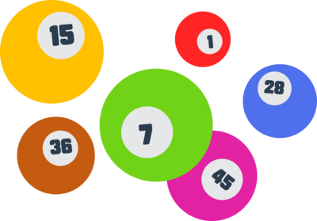

    

# 프리코스 3주차 미션 - 로또

> 가상으로 해보는 로또! 로또! 로또!🤑
 

## 도메인 로직
**복권**: `구매자의 로또 번호`와 `당첨 번호`를 비교해 `일치하는 번호의 개수`에 따라 `당첨금을 받는` 과정
 
 

## 기능 목록
- 입력값 받기 (구입 금액)
  - 입력값으로 받은 구입 금액이 **숫자가 아니면** 에러 메시지와 함께 예외를 발생시킨다.
  - 입력값으로 받은 구입 금액이 **천 단위가 아니면** 에러 메시지와 함께 예외를 발생시킨다.
  
- 번호 생성하기 (🚨`Randoms.pickUniqueNumbersInRange` 메서드 이용하기🚨)
  - 생성된 번호를 오름차순으로 정렬한다.
  
- ⭐생성된 번호를 구매자의 로또 번호로 이용하기 (🚨`Lotto` 클래스에서 해결하기🚨)
  - 번호 개수가 **6개가 아니면** 에러 메시지와 함께 예외를 발생시킨다.
  - **중복된 번호가 있으면** 에러 메시지와 함께 예외를 발생시킨다.
  - **1 ~ 45의 범위를 벗어나는 번호가 있으면** 에러 메시지와 함께 예외를 발생시킨다.
  
- 입력값 받기 (당첨 번호 & 보너스 번호)
  - 입력값으로 받은 당첨 번호가 **5개의 쉼표로 구분되지 않으면** 에러 메시지와 함께 예외를 발생시킨다.
  - 입력값으로 받은 보너스 번호가 **숫자가 아니면** 에러 메시지와 함께 예외를 발생시킨다.
  
- ⭐입력값을 당첨 번호와 보너스 번호로 이용하기
  - 당첨 번호는 `Lotto` 클래스를 통해 유효성 검사를 시행한다.
  - 입력값으로 받은 보너스 번호가 **1 ~ 45의 범위를 벗어나면** 에러 메시지와 함께 예외를 발생시킨다.
  - 입력값으로 받은 보너스 번호가 **당첨 번호에 이미 있다면** 에러 메시지와 함께 예외를 발생시킨다.
  
- ⭐로또 번호와 당첨 번호 비교하기
  - 구매자의 로또 번호와 **당첨 번호를 비교해 일치하는 번호의 개수**를 기록한다.
  - 구매자의 로또 번호와 **보너스 번호를 비교해 일치하는 번호의 개수**를 기록한다.
  
- 로또 당첨금 정보가 담긴 클래스 만들기 (🚨enum 사용하기🚨)
  - 일치하는 번호의 개수로 당첨 금액을 반환한다.
  - 일치하는 번호의 개수로 당첨 메시지를 반환한다.
  
- ⭐당첨 금액 계산하기
  - 일치하는 번호의 개수와 enum을 이용해 **당첨 금액**을 산출한다.
  - 각 로또 티켓에 대한 당첨 금액들을 합산해 **총 수익**을 반환한다.
  
- 당첨 통계 출력하기
  - 당첨 통계를 초기화한다.
  - 총 수익을 이용해 당첨 통계를 업데이트한다.
  - 총 수익을 이용해 수익률을 구한다.
