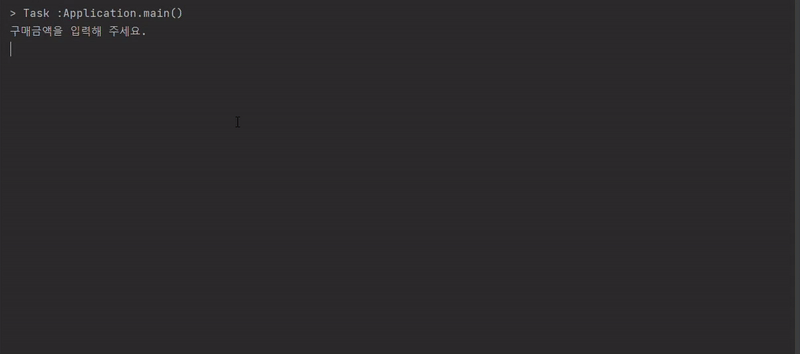

<p align="center">
    
</p>

# 미션 - 로또

###### `우아한테크코스 3주차 미션을 진행한 저장소 입니다.`


###### `WARNING 메세지는 무시하셔도 됩니다.`
## 🚀 사용자 유의 사항
```
- 로또 번호의 숫자 범위는 1~45까지이다.
- 로또 1장의 가격은 1,000원이다.
- 당첨 번호 추첨 시 중복되지 않는 숫자 6개와 보너스 번호 1개를 뽑는다.
- 당첨 번호는 쉼표(,)로 구분한다.
- 당첨은 1등부터 5등까지 있다. 당첨 기준과 금액은 아래와 같다.
    - 1등: 6개 번호 일치 / 2,000,000,000원
    - 2등: 5개 번호 + 보너스 번호 일치 / 30,000,000원
    - 3등: 5개 번호 일치 / 1,500,000원
    - 4등: 4개 번호 일치 / 50,000원
    - 5등: 3개 번호 일치 / 5,000원
```

