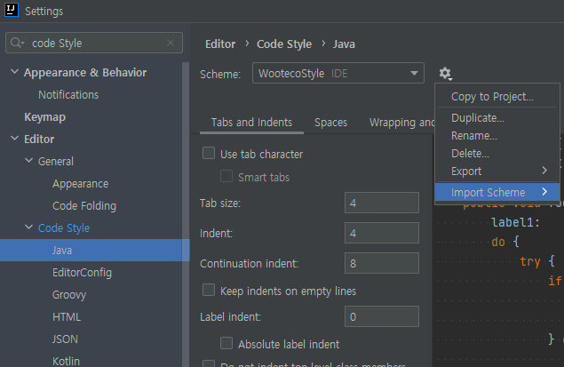
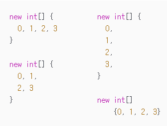
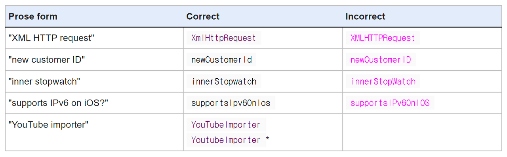

## Java Code Convention(Google Java Style Guide)


### 적용하기
- https://github.com/woowacourse/woowacourse-docs/blob/main/styleguide/java/intellij-java-wooteco-style.xml
- 해당 xml 파일을 IDE에 적용
- 
 
---

## Java Convention 필수 주의사항(프로그래밍 요구사항)

### 4.2 블럭 들여쓰기: +4 스페이스(우테코 Java Style)
새 블록 또는 블록과 유사한 구조(block-like construct)가 열릴 때마다 들여쓰기가 네 칸씩 증가합니다. 블록이 끝나면 들여쓰기는 이전 들여쓰기 단계로 돌아갑니다. 들여쓰기 단계는 블록 전체의 코드와 주석 모두에 적용됩니다.

<br>

###4.4 열 제한: 120 (우테코 Java Style)
Java 코드의 열 제한은 120자입니다. "문자"는 유니코드 코드 포인트를 의미합니다.

<br>

###4.5.2 들여쓰기 지속은 최소 +8 스페이스(우테코 Java Style)
줄 바꿈 시 그 다음 줄은 원래 줄에서 +8 이상 들여씁니다.

<br>

### 4.6.1 수직 빈 줄(우테코 Java Style)
...

빈 줄은 가독성을 향상시키기 위해서라면 어디든(예를 들면 논리적으로 코드를 구분하기 위해 문장 사이) 사용 될 수 있습니다. 클래스의 첫 번째 멤버나 초기화(initializer) 또는 마지막 멤버 또는 초기화( initializer) 뒤의 빈 줄은 권장되지도 비권장하지도 않습니다.

클래스의 첫 번째 멤버나 초기화(initializer) 앞에 있는 빈줄을 강제하지 않습니다.

...

### 변수 이름에 자료형은 사용하지 않는다(추가)
변수이름에 자료형, 자료 구조명을 사용하지 않는다.

### 구현 순서도 코딩 컨벤션이다(추가)
클래스는 상수, 멤버 변수, 생성자, 메서드 순으로 작성한다


### 4.1 괄호

#### 4.1.1 괄호는 선택사항에서도 쓰인다.

괄호는 if, else, for, do, while 구문에 쓰이는데 몸체가 없거나 한 줄의 구문에도 괄호가 쓰인다.

#### 4.1.2 비어있지 않은 블럭: K & R 스타일

괄호는 비어있지 않은 블럭과 block-like construct에서 Kernighan과 Ritchie 스타일(Egyptian brackets)을 따른다.

- 여는 괄호 앞에는 줄 바꿈이 없음
- 여는 괄호 다음에 줄 바꿈
- 닫는 괄호 전에 줄 바꿈
- 닫는 괄호 다음에 줄 바꿈, 그런데 이것은 오직 구문이 끝나거나 메소드,  생성자, 클래스가 끝났을 때 적용된다. 예를들어 else나 콤마뒤에 나오는 부분은 줄 바꿈을 하지 않는다.

예:

```java
return () -> {
  while (condition()) {
    method();
  }
};

return new MyClass() {
  @Override public void method() {
    if (condition()) {
      try {
        something();
      } catch (ProblemException e) {
        recover();
      }
    } else if (otherCondition()) {
      somethingElse();
    } else {
      lastThing();
    }
  }
};
```

Enum 클래스에는 예외가 있다. 4.8.1

#### 4.1.4 빈 블럭들: 아마 간결하게

빈 블럭이나 block-like construct 에서는 K & R 스타일을 따를 수 있다. 대안으로 { } 괄호 안에 문자가 없거나 줄바꿈이라면 열자마자 끝날 수 있다. 하지만 멀티 블럭 구문에서는 할 수 없다.

예:

```java
  // 허용
  void doNothing() {}

  // 마찬가지로 허용
  void doNothingElse() {
  }
```

```java
 // 허용되지 않음: 멀티 블럭 구문에서는 간결한 빈 블럭을 사용할 수 없음
  try {
    doSomething();
  } catch (Exception e) {}
```

#### 4.6.2 수평 공백(Horizontal whitespace)-띄어쓰기
1. if, for, catch와 같은 예약어를 해당 줄 뒤에 오는 여는 괄호( ( ) 괄호로부터 분리한다.
2. else, catch와 같은 예약어를 해당 줄 앞에 오는 닫는 중괄호( } )에서 분리한다.
3. 여는 중괄호( { ) 관련 두 가지 예외

   예외: @SomeAnnotation({a, b}) (공백 없음)<br>
   예외: String [][] x = {{"foo"}} ( {{ 사이에 공백 없음)
4. 이항 또는 삼항 연산자 양쪽에서 사용. 이는 'operator-like' 기호에도 적용된다.
5. 더블 슬래시( // )로 주석 처리를 할 때 더블 슬래 기호에서 한 칸 띄운다. 여러 칸 띄우는 것도 허용되지만, 필요치 않다.
6. 타입과 변수 선언 사이에 공백을 넣는다. List <String> list

<br>

#### 4.8.2.1 한 번에 하나의 변수 선언
- 모든 배열 선언은 하나의 배열만 생성한다.
- 'int a, b;' 이렇게 한 번의 선언으로 여러 개의 변수를 동시에 생성하지 않는다. <br>예외: for 반복문에서는 여러 개의 변수 생성이 허용된다.( for(int a, b = 1; ; ;) )

<br>

####4.8.3.1 배열 초기화 : 'block-like'와 같이
- 배열을 초기화할 때 block-like construct 형태로 포맷팅 할 수 있다.



<br>

#### 4.8.4 Switch 구문
4.8.4.3 default 구문<br>
각 switch 구문은 default 구문을 가진다.(default 구문이 코드가 있는지 없는지의 여부와는 상관없이)

<br>

#### 4.8.6 주석
4.8.6.1 블록 주석 스타일

블록 주석은 주변 코드와 같은 들여 쓰기 레벨을 가진다. 주석 형태는 /*... */ 또는 //...이다.

/*... */ 형태로 주석을 사용할 때는 * 마크로 주석이 시작된다.


<br>

#### 4.8.8 숫자 리터럴
long 형태의 정수 리터럴은 대문자 L을 접미사로 사용한다.<br>
숫자 1과 구별하기 위한 목적이므로 절대 소문자를 사용하지 않는다.

<br>

#### 5.2.1 패키지 이름
패키지 이름은 여러 __소문자__ 형태의 글자들이 함께 결합되어 있는 형태를 가진다.

<br>


#### 5.2.2 클래스 이름
클래스 이름은 __UpperCamelCase__ 형태로 작성한다.<br>
일반적으로 클래스 이름은 명사 형태로 작성한다.(Character, ImmutableList) 인터페이스 이름 또한 명사 형태로 작성한다.<br>(List) 하지만 형용사 형태를 가지기도 한다.(Readable)
테스트 클래스는 테스트하는 클래스 이름 뒤에 'Test'를 붙이는 형식으로 이름을 짓는다.(HashTest or HashIntegrationTest)


<br>

#### 5.2.3 메서드 이름
메서드 이름은 __lowerCamelCase__ 형태를 가진다.<br>
메소드 이름은 동사 형태로 작성한다.(sendMessage, stop)<br>
논리적 컴포넌트를 구분하기 위해 JUnit 테스트에서 사용되는 메소드 이름에는 언더스코어가 나올 수 있다.
<br>각 컴포넌트는 lowerCamelCase 형태로 작성된다.
한 가지 전형적인 패턴은 <methodUnderTest>_<state>이다.(pop_emptyStack)

<br>

#### 5.2.4 상수 이름
상수 이름은 CONSTANT_CASE를 사용한다.<br>
CONSTANT_CASE : 대문자로만 이루어짐. 각 단어는 언더스코어(_)로 연결된다.

<br>

#### 5.2.5 상수가 아닌 필드 이름
상수가 아닌 필드 이름(static 또는 기타)은 __lowerCamelCase__ 형태를 가진다.<br>
일반적으로 이름은 명사나 명사구로 작성한다.(computedValues, Index)

<br>

#### 5.2.6 파라미터 이름
파라미터 이름은 __lowerCamelCase__ 형태를 가진다.<br>
public 메서드에서 하나의 문자로 이루어진 파라미터의 사용은 되도록 피하자.

<br>

#### 5.2.7 지역 변수 이름
지역 변수 이름은 lowerCamelCase 형태를 가진다.<br>
final이나 불변인 경우에도 지역 변수는 상수로 취급되지 않는다. 그리고 상수의 형태로 지역 변수를 생성하면 안 된다.
테스트 메서드 네이밍에 대한 명확한 규칙은 없다.

<br>

#### 5.3 카멜 케이스
1. 구문을 순수 ASCII로 변환하고 아포스트로피(')를 모두 제거한다.( "Kim's algorithm" -> "Kims algorithm" )
2. 1의 결과를 단어로 쪼갠다. 그리고 공백과 나머지 구두점으로 분할한다(일반적으로 하이픈 - 사용한다)
   <br>추천: 단어가 이미 일반적인 카멜 케이스 형태를 가지고 있다면, 단어를 각개의 형태로 분리한다("AdWords" -> "ad words") 참고할 점은, "iOS'와 같은 단어는 그 자체로 카멜 케이스가 아니다. 모든 관습을 무시하기 때문이다. 따라서 이 단어의 경우 앞서 언급한 추천 사항이 적용되지 않는다.
3. 모두 소문자 형태로 바꾼다.(약어도 포함) 그 뒤 첫 글자를 대문자로 한다.
   각 단어의 첫 글자는 대문자로.
   각 단어의 첫 글자를 제외한 나머지는 소문자로.
4. 모든 글자를 하나의 식별자 형태로 합친다.



<br>

###7. Javadoc
####7.1.1 일반 형식
Javadoc의 일반적인 형태는 다음과 같다.

```java
/**
 * Multiple lines of Javadoc text are written here,
 * wrapped normally...
 */
public int method(String p1) { ... }
```

혹은 한줄의 예는:

```java
/** An especially short bit of Javadoc. */
```

### 7.3 Javadoc이 어디에 쓰이는지
최소한 Javadoc은 매 public class에 쓰이고 그러한 클래스안에 public, protected 멤버에 쓰인다. 몇몇의 예외는 아래와 같다.

추가 Javadoc 본문은 있을 수 있다. (7.3.4 Javadoc이 필요없는 경우 참조)

####7.3.1 예외: 자가-설명 메소드
Javadoc은 간단하고 명료한 메소드, 예를들어 getFoo같은 경우 선택적이다. 그런 경우는 foo를 반환한다 이외에는 도저히 설명할 길이 없는 경우이다.

중요: 그렇다고 해서 독자가 알아야할 정보를 빠트리는 것은 안된다. 예를들어 getCanonicalName의 경우 문서화를 빠트리지 말자. 왜냐하면 일반적 독자는 canonical name이 무슨 뜻인지 모르기 때문이다.

#### 7.3.2 예외: 오버라이드
Javadoc은 슈퍼 타입 메소드를 오버라이드를 한다면 항상 존재하지는 않는다.

#### 7.3.4 Javadoc이 필요없는 경우
다른 클래스 및 멤버는 필요에 따라 또는 원하는대로 Javadoc을 가진다.

구현 주석이 클래스 또는 멤버의 전반적인 용도 또는 동작을 정의하는 데 사용될 때마다 해당 주석은 대신 Javadoc으로 작성된다.(/ ** 사용).

불필요한 Javadoc은 7.1.2, 7.1.3, 7.2절의 포맷 규칙을 엄격히 준수 할 것을 요구하지는 않지만, 물론 권장된다.
