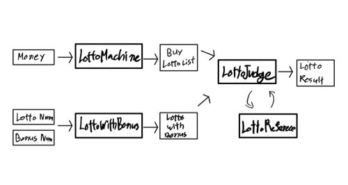

# 로또 게임 기능 목록.



## Domain


### **LottoMachine**

- [x] 로또 구입 금액 / 1000 한 개수만큼의 로또 값 반환

- [x] 중복되지 않는 숫자 6개  `pickUniqueNumbersInRange()` 사용
  - [x] ex)`1,2,3,4,5,6`
  
- [x] buyLottoList
  - [x] ```java
    [8, 21, 23, 41, 42, 43] 
    [3, 5, 11, 16, 32, 38] 
    [7, 11, 16, 35, 36, 44] 
    ```


### **LottoJudge**

- [x] 사용자가 구매한 로또 번호와 당첨 번호를 비교하여 당첨 내역  및 수익률을 계산 
  - [x] 일치하는 번호를 카운트 한다.
  - [x] 5개 일치시 보너스 번호를 비교한다.
- [x] Lotto Reference에게 일치하는 번호를 넘겨 Lotto Result를 생성한다.

	- [x] Lotto Result는 Lotto Reference의 Enum 상수(등수)와, 횟수를 반환한다.


### **LottoReference**

- [x] 로또 당첨표
	- 당첨은 1등부터 5등까지 있다. 당첨 기준과 금액은 아래와 같다.
		- 1등: 6개 번호 일치 / 2,000,000,000원
		- 2등: 5개 번호 + 보너스 번호 일치 / 30,000,000원
		- 3등: 5개 번호 일치 / 1,500,000원
		- 4등: 4개 번호 일치 / 50,000원
		- 5등: 3개 번호 일치 / 5,000원
- [x] Lotto Judge 가 카운트한 값과 결과 당첨표를 비교한다.
  - [x] Enum 상수를 반환한다.
- [x] Lotto Result을 입력하면 수익율을 계산해 출력해준다.
  - [x] 총 당첨 금액을 구한다.
  - [x] 수익률을 계산한다.
    - [x] 수익률은 소수점 둘째 자리에서 반올림한다. (ex. 100.0%, 51.5%, 1,000,000.0%)
    


## VO (Value Object)


###  **Money**

- [x] 로또 구입 금액을 입력하면 구입 금액에 해당하는 만큼 로또를 발행해야 한다.
  - [x] 로또 구입 금액을 입력 받는다. 구입 금액은 1,000원 단위로 입력 받는다.
  - [x] 1,000원으로 나누어 떨어지는 경우
  	- [x] 로또 구입 금액 / 1000 한 개수만큼의 로또 값 출력
  - [x] 1,000원으로 나누어 떨어지지 않는 경우  `IllegalArgumentException` 발생 후 메시지 출력
  	- [x] "[ERROR] 입력한 금액이 1,000원으로 나누어 떨어지지 않습니다."
  	- [x] "[ERROR] 숫자만 입력 가능합니다."


###  **Lotto**

- [x] 로또 발급 : 당첨 번호를 입력 받는다. 번호는 쉼표(,)를 기준으로 구분한다.
  - [x] 정상 값

    - [x] 로또 번호의 숫자 범위는 1~45까지이다.
    - [x] 1개의 로또를 발행할 때 중복되지 않는 6개의 숫자를 뽑는다.

    - [x] 로또는 오름차순, List<Integer>, ex) [3, 5, 11, 16, 32, 38] 

  - [x] 예외 처리  `IllegalArgumentException` 발생 후 메시지 출력

    - [x] "[ERROR] 로또 번호는 6자리 입니다."
    - [x] "[ERROR] 숫자만 입력 가능합니다."
    - [x] "[ERROR] 로또 번호의 범위는 1부터 45가지 입니다."
    - [x] "[ERROR] 로또 번호는 중복될수없습니다."


### LottoWithBonus

- [x] Lotto 값에 중복되면 안된다.
- [x] 하나의 값만 가진다.
- [x] 숫자 범위는 1~45까지이다.
- [x] 사용자가 잘못된 값을 입력할 경우 `IllegalArgumentException` 발생,
  - [x] "[ERROR] 보너스 번호의 범위는 1부터 45가지 입니다."
  - [x] "[ERROR] 보너스 번호는 로또 번호와 중복될수없습니다."


### BuyLottoList

- [x] LottoMachine을 통해 발급 받은 로또 리스트 (랜덤으로 발급된 값)


### LottoResult

- [x]  Enum 상수(등수)와, 횟수


## View

### InputHandler

- [x] inputMoney : "구입금액을 입력해 주세요."
  - [x] String to int, handling exception (숫자만 가능)
- [x] inputLottoNumber : "당첨 번호를 입력해 주세요."
  - [x] String to List<Integer>, handling exception (숫자만 가능)
- [x] inputBonusNumber : "보너스 번호를 입력해 주세요."
  - [x] String to Integer, handling exception (숫자만 가능)


### OutputHandler

- [x] printBuyLottoList : 구매한 로또 출력

- [x] LottoResult 값 출력

  - [x] winningStatistics : 당첨 통계

    ```
    당첨 통계
    ---
    3개 일치 (5,000원) - 1개
    4개 일치 (50,000원) - 0개
    5개 일치 (1,500,000원) - 0개
    5개 일치, 보너스 볼 일치 (30,000,000원) - 0개
    6개 일치 (2,000,000,000원) - 0개
    ```

  - [x] printYield : 수익률

  	```
  	총 수익률은 62.5%입니다.
  	```


## Controller

view 와 domain 을 연결시키는 부분입니다.

view 를 통해 사용자에게 입력 및 출력합니다. 입력 받은 값을 domain에게 전달해 값을 받습니다.

- [x] run()

	- view 와 domain 을 연결

- [x] inputMoney 

	- view 를 통해 사용자로부터 금액 입력
	- domain의 Money에게 금액 입력

- [x] inputLotto

	- view 를 통해 사용자로부터 로또번호 입력

	- domain의 Lotto에게 번호 입력

- [x] inputBonus

	- view 를 통해 사용자로부터 보너스 번호 입력
	- domain의 LottoWithBonus에게 금액 입력

- [x] outputResult
	- 당첨 통계와 수익률을 출력한다.


---

### 프로그래밍 요구 사항

- 핵심 로직을 구현하는 코드와 UI를 담당하는 로직을 분리
- 함수(또는 메서드)의 길이가 15라인을 넘어가지 않도록
- indent(인덴트, 들여쓰기) depth를 3이 넘지 않도록 
	- 예를 들어 while문 안에 if문이 있으면 들여쓰기는 2이다
- Java Enum을 적용
- 도메인 로직에 단위 테스트

---

