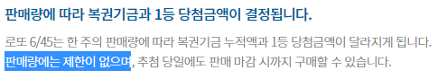

# 구현할 기능 목록

> 유효값을 확인하는 부분 중 중복 서술되는 부분이 많아 따로 분리하였습니다. **Bold**처리 된 글자를 사용하여 기능 목록에서 수행할 유효값 체크를 적었습니다.

## 기능 목록

- [x] 출력을 통해 사용자에게 입력값을 안내한다.
- [x] 출력을 통해 입력값을 바탕으로 도출값을 안내한다.
- [x] 로또 구입 금액을 입력받는다.
  - [x] 입력받은 로또 구입 금액을 정수로 전환한다.

- [x] 로또 구매 갯수만큼 로또를 구매한다.
  - [x] 입력받은 로또 구입 금액값이 올바른지 확인한다(**1000**).
  - [x] `Randoms`의 `pickUniqueNumbersInRange()`를 활용해 1부터 45의 번호 6개를 오름차순으로 뽑아 로또 번호로 지정한다.
  - [x] 로또 번호들을 출력한다.

- [x] 당첨 번호를 입력받는다.
  - [x] 입력받은 당첨 번호들을 정수로 전환한다.
    - [x] 입력받은 당첨 번호들이 올바른지 확인한다(**쉼표, 로또의 범위, 중복값**).

- [x] 보너스 번호를 입력받는다.
  - [x] 입력받은 보너스 번호를 정수로 전환한다.
    - [x] 입력받은 보너스 번호가 올바른지 확인한다(**로또의 범위**).

- [x] 로또 당첨 번호 객체를 생성한다.
  - [x] 입력받은 당첨 번호들과 보너스 번호가 올바른지 확인한다(**당첨 번호에 포함**).

- [x] 당첨 통계를 도출한다.
  - [x] 구매한 로또 하나씩 몇 등인지 확인한다.
    - [x] 번호가 몇 개 일치하는지 확인한다.
    - [x] 일치하는 번호가 5개일 경우, 보너스 볼이 일치하는지 확인한다.
  - [x] 확인한 결과를 정리한다.
- [x] 당첨 통계를 출력한다.
- [x] 수익률(당첨금액 / 구입금액)을 계산한다.
  - [x] 당첨 통계를 바탕으로 당첨금액을 계산한다.
- [x] 수익률을 출력한다.

## 유효값 체크(`IllegalArgumentException`)

- [x] **정수**로 변환할 수 없는 경우
- [x] **1000**으로 나누어 떨어지지 않는 경우
- [x] **쉼표**를 기준으로 값을 나누었을 때 6개가 아닌 경우
- [x] **로또의 범위**(1~45)를 벗어난 경우
- [x] **중복값**이 있을 경우
- [x] 보너스 번호가 **당첨 번호에 포함**될 경우

# 초기 구현

## 구현 전 클래스 지정

> 구현할 기능 목록들에 따른 각자의 역할을 생각하고 구현할 클래스를 나눠보았다.

### 로또샵 클래스

로또를 구매하고 확인하는 전반적인 진행 담당

### 메시지 출력 클래스

구입 금액 입력 요구, 로또 갯수, 로또 번호 출력 등의 기능을 담당

### 메시지 입력 클래스

사용자가 입력한 메시지를 올바른 자료구조로 변형

### 유효값 체크 클래스

입력받은 값이 올바른지 확인

### 로또번호 클래스(문제에서 주어진 Lotto 클래스 이용)

`Randoms.pickUniqueNumbersInRange()`를 통해 생성된 로또 번호로 생성

### 당첨번호 클래스

사용자의 입력을 통해 당첨 번호와 보너스 번호를 지정

### 통계 클래스

로또번호 클래스와 당첨번호 클래스를 비교하며, 당첨 통계를 작성

### 계산 클래스

당첨 통계를 바탕으로 당첨금액과 수익률을 계산

## 고민한 사항

- 시작하자마자 출력 클래스에 대한 고민이 생겼다.
  - 출력할 내용은 크게 7가지(구입금액 입력 요구, 구매갯수 확인, 구매한 로또 번호들, 당첨번호 입력 요구, 보너스번호 입력 요구, 당첨 통계, 수익률)이다.
    - 구입금액 입력 요구, 당첨번호 입력 요구, 보너스번호 입력 요구는 지정된 텍스트를 출력한다.
    - 나머지 항목들은 지정된 텍스트 + @를 출력한다.
  - 그렇다면 해당 클래스는 `지정된 텍스트 출력`, `지정된 텍스트 + @ 출력`으로 나눌 수 있다.
  - 지정된 텍스트들은 바뀔 일이 없으며, 이는 enum 클래스로 선언하는 게 나을 것 같았다.
    - 2주차 때 우연치않게 enum에 대해 공부하게 되었는데(3주차에서 나올 줄 몰랐어요.. 정말로!), 덕분에 생각의 흐름을 쉽게 가져갈 수 있던 것 같다.
  - 출력 클래스 자체를 enum으로 해보고 싶었으나, 텍스트 + @에 대한 다형성을 어떻게 구현해야 할 지 막막했다. 따라서 리팩터링 때 생각해보기로 했다.
- 유효값 체크 클래스의 출력 텍스트 또한 enum으로 선언할 수 있다고 생각되었다.
  - `입력값이 null입니다.` 등의 텍스트도 지정된 텍스트이므로, 해당 값들도 enum으로 선언할 수 있을 것 같았다.
  - 다만, 출력 클래스에서 지정한 값들과는 별개로 관리해야 한다고 생각되었다. 둘 다 같은 형태이긴 하겠지만, 사용되는 목적이 다르니 `LottoText`와 `ExceptionText`로 작성하면 좋을 것 같았다.
  - 그렇다면 Text라는 기본 클래스를 만들고, 위의 두 enum 클래스에서 상속하면 편하겠다!
  - 헌데 enum 클래스는 상속이 불가했다. 함축적으로 enum 객체를 상속받고 있기 때문이라 한다. 따라서 그냥 같은 형태로만 만들어주었다.
  - 대신 직접 내용에 해당하는 `IllegalArgumentException`을 던질 수 있도록 작성했다. 어라.. 이러면 `ExceptionText`로 작성하면 안되는데..?
  - 유효값이 아닐 경우를 모아두는 거니까.. 간단하게 `Invalid`로 하기로 했다.
- 테스트코드를 위한 메서드를 main에 작성하는 게 옳은 걸까?
  - NULL 테스트를 위해 코드를 작성했다. 이 때, 해당 메시지가 `입력값은 null일 수 없습니다.`가 나오는지 정확히 파악하려면, 그리고 해당 메시지가 변경되어도 검증할 수 있으려면 `Invalid.content`를 얻어와야 한다.
  - 그러나 main 내에서는 `Invalid.content`를 얻어올 일이 없으며, 테스트코드를 위한 메서드를 작성하게 될 것 같았다.
  - 그렇게 좋은 방법은 아닌 것 같아 에러메시지 내부에서 `null`을 포함하는지만 검사하기로 했다. 극단적으로 갔을 때, 테스트코드가 주가 되어버리는 게 생길.. 어? TDD에선 그런 식으로 하지 않을까..?
  - 고민을 계속 하다가, 결국 `Invalid`의 `toString()`에서 `content`를 반환하는 식으로 오버라이드하였다. 따라서 내부 코드도 조금 단순하게 가져가고, 테스트코드에서도 제대로 비교할 수 있도록 해 보았다.
  - 하지만 본질적인 의구심은 해결하지 못 했다.. 확장적인 코드를 작성하여 main과 test를 둘 다 신경쓰는 방식을 도입하는 게 제일 나은 것 같아서 해당 방법을 구상하였으나, 실제 TDD를 작업할 때는 어떠한 방식을 선택할까?
  - `비즈니스 로직과 완전히 상관없는, 테스트만을 위한 메서드는 필요하지 않다`라는 답변을 얻었다. 물론 사람마다 다르다곤  하지만.. 나도 여기에 동의하는 바이다.
  - 또한 테스트코드에서는 에러메시지를 하드코딩하고 비교하는 방법이 쓰이는 것 같다. 잘못된 에러메시지를 가져오면 바로 알 수 있게끔.. 헌데 내 구조는 에러메시지가 변화되지 않는 형태이고, 검증 메서드에 값을 던졌을 때 해당 에러가 제대로 발생하는지 확인하는 형태이기 때문에.. 이부분은 조금 더 생각해봐야 할 것 같다.
- 20억을 초과한 값
  - 1등보다 많은 값만큼 로또를 살 사람은 없다고 생각.. 했으나, 시뮬레이션이기 때문에 있을 수도 있다고 판단되었다..
  - 헌데 값을 Int형으로 제한할 경우, 21억이 넘어가면 에러가 터진다.
  - 그렇다고 Long을 쓰자니, 로또 용지를 어마어마하게 발급해줘야 한다..
  - 
  - 아.. 판매량에는 제한이 없구나.. 그럼 어마어마하게 발급해주는 것도 있을 수 있겠구나..
  - 가게마다의 제한은 있을 수 있겠지만.. 적어도 21억 이상으로 시뮬레이션을 돌리고 싶은 사람은 있을 수 있겠다 싶었다.
  - 근데 21억정도만 사도 210만개의 출력이 콘솔에 찍히는데, 그 이상으로 받아들인다면 좀 무리이지 않을까?
  - 제한 사항은 내가 설정하는거니, 가게 사정상 Int형의 범위를 벗어나는건 안된다고 설정하고 진행해야겠다 싶었다. Long을 하고 싶긴 하지만.. 그에 따를 나비효과가 좀 무서웠다 ㅠ
- 값 확인보다 차라리 숫자로 바꿔보며 나오는 에러를 처리하는게 낫지 않을까?
  - null, 문자열, 정수값을 넘은 경우 모두 `NumberFormatException`을 발생시킨다.
  - 굳이 내가 확인처리를 하지 않고, `Integer.parseToInt`에게 할 일을 맡긴 뒤 나오는 에러를 처리해주는게 더 효율적이지 않을까?
    - 0 이하의 값인지만 더 확인해주면, 따로 건드릴 일이 없을 것 같았다.
    - 더 이해하기 쉽고, 확실한 처리 능력일 듯 했다.
  - 따라서 null이 입력된 경우, 숫자가 입력되지 않은 경우, 정수값의 범위를 넘은 경우에 대한 사항들을 모두 `Integer`에게 맡기기로 했다.
  - 헌데 이렇게 되니, `Validate`가 해당 과정을 지녀야 할 지 의심되었다. 미리 확인하는 것과 변형하며 나오는 에러를 도출해주는 건 다르지 않나 싶었다..
  - 따라서 네이밍을 `Convert`로 지어주고, 해당 전환과정 중 혹시 모를 에러를 살펴본다는 식으로 구성하기로 하려 했다. 그러나 이미 Invalid가 에러메시지를 넘겨주는 녀석이니, 이 녀석을 잘 작성하여 다형성까지 구현해주고 싶은 마음이 생겼다.
  - 구글링으로 [인터페이스를 구현한 Enum 클래스](https://vvshinevv.tistory.com/78)를 확인하였고, 해당 방법을 사용해보기로 했다. 그러나.. 애초에 enum은 같은 형태를 지닌 녀석들을 나열하기 위함이고, enum 객체 하나마다 파라미터를 달리 받아 도출해내는 건 class에서의 역할로 보였다. 에러메시지는 여러 파라미터 타입을 받으며 때에 따라 동작해야 하고, 이를 모두 enum으로 퉁치려는 건 위험해 보였다.
  - 억지로 구현해보려고도 했으나.. 해당 블로그 글에 '[특별히 Generic Parameterized Type에 제한](https://vvshinevv.tistory.com/56)을 두지 않으면' 가능하다는 듯 보였다. 나는 파라미터를 하나씩 세팅하려 했으니.. 해당 조건에 맞지 않았다.
  - 물론 방법이 있을 지도 모른다. 하지만 몇 시간 째 이것만 붙잡고 있느라 다른 것들을 제대로 구현하지도 못 한 상황이니, 나중에 더 공부하기로 하고 우선은 `Convert` 내부를 완성시키기로 했다.
  - 헌데 또 마음에 들지 않았다. `Convert` 자체에서 유효값을 확인하게 되면, 다른 클래스에서 유효값을 검사하게 될 시 코드 중복이 생길 수 있었다. 그렇다면 `Validate` 클래스가 따로 구분이 되어야 했다.
  - `Validate` 클래스가 검사하던 도중 에러가 발생하면 `Invalid` enum 클래스를 사용해 예외를 발생시킨다. 헌데 `Invalid`는 어디서나 접근할 수 있었고, `Validate`의 역할을 다른 곳에서 대신할 수도 있었다.
  - 따라서 `Invalid` 자체를 `Validate` 안에 작성해서 사용하던가, 아니면 `Validate`가 에러를 발생시키는 부분을 제거하거나, `Validate` 자체에서 여러 파라미터에 대응하여 에러를 판단해야 했다.
  - 마지막 방법은 지금까지 계속 실패한 방법이고, 첫번째나 두번째를 사용해야 했다.
  - 근데, 굳이 에러 관련 텍스트를 enum으로 지정해야 할 필요가 있을까? 지난주 프로젝트를 진행하며, enum의 목적은 전역 상수를 편하게 관리할 수 있는 방법이었다. 하지만 에러에 대한 설명은 재활용되지도 않고, 오히려 `Validate`의 책임을 뺏어가며 다른 곳에서의 접근을 허용하는 형태였다.
  - 따라서 enum을 해제하고, 텍스트 자체를 `Validate`에서 사용하기로 했다.
- 그렇다면 다시 돌아와서, `Integer.parseToInt`를 실행하다 에러가 발생했을 시 어떻게 처리해야 하는가?
  - `Convert`는 값의 전환만 책임진다.
  - `Validate`는 값의 확인을 책임진다.
  - 값을 전환하다 에러가 나는 경우는, 결론적으로 `Convert`의 책임이 있다.
  - `Convert`는 값을 전환하다 생기는 에러를 책임질 의무가 있다.
  - 즉 `Validate`는 문제의 조건에 대한 확인을, `Convert`는 값의 전환을 책임진다고 하면 `Convert`에서 Exception 처리는 자연스러울 수 있다.
  - `throw new IllegalArgumentException`을 `Validate`에서만 처리하는 건 오히려 각각 클래스의 책임을 회피하는 것과 같다. 각 클래스는 자신의 메서드를 실행시키는 도중 나오는 예외를 스스로 처리해야 할 것이며, `Validate`는 단지 조건에 맞지 않으면 `IllegalArgumentException`을 던지는 것일 뿐, 모든 예외를 맡을 이유는 없다.
- 로또 당첨 enum의 구조를 어떻게 잡아야 할 것인가?
  - enum 클래스로 1등부터 등외까지 작성한 와중, 문제가 생겼다. 2등의 기준은 `로또 번호를 5개 맞히고, 보너스 번호를 맞췄을 때`이다. 3등의 기준은 `로또 번호를 5개 맞췄을 때`이다.
  - 내부 값의 차이가 있어야 하는데, 2등과 3등 둘 다 로또 번호는 5개를 맞춘 상태이다.
    - 상금 차이는 있지만.. 우선 맞춘 개수로는 1:1 매칭이 불가하다.

  - 따라서 제대로 된 순위를 발표하려면, 로또 번호를 5개 맞힌 상태에서 보너스 번호를 검증하여 2등과 3등을 나눠야 한다. Map을 사용하여 맞춘 갯수와 등수(2등 제외)를 매칭시켰고, 3등인 경우 보너스번호를 판별하여 2등으로 올릴 지 말지 결정하는 로직을 구현했다. 이는 enum이 아니더라도 충분히 구현할 수 있는 방법이며, enum의 의의가 없는 듯 했다. 어떻게 하면 enum을 제대로 잘 살릴 수 있을까?
  - 단순히 로또 번호를 맞춘 갯수로는 힘들고.. 그렇다고 보너스 번호까지 필드값으로 주자니, enum에 맞는 구조인지 모르겠다는 생각이 들었다.
    - 보너스 번호는 2등만 신경쓰면 되는 값이다. 다른 등수들은 신경쓸 필요가 없다.

  - 그렇다면 로또 번호를 맞췄을 때 2점, 보너스 번호를 맞췄을 때 1점을 주면 어떨까?
    - 다른 사람이 코드를 한 눈에 보고 이해할 수 있을까? 2등과 3등을 나누기 위해 한다지만.. 점수로 매겼을 경우 기존의 로또 당첨과 이질적인 형태라 점수에 대한 규칙을 참고하지 않으면 힘들 것이다.

  - 그렇다면 차라리, 맞춘 로또 갯수와 금액을 따로 분리하여 들고 있으면 되지 않을까?
    - 맞춘 로또 갯수가 5개일 때, 보너스 번호가 포함되어 있으면 금액 수령을 한 단계 올려주는 거니까.. 어쩌면 나열한다는 의미에서 이 부분이 더 맞을 것 같다.
    - 그렇다면 `3, 4, 5, 6`과 `5등, 4등, 3등, 2등, 1등`으로 개수의 차이가 난다.
    - 해당 부분은 통계를 계산할 시에 로또 번호 5개를 맞췄으면서 보너스번호를 맞췄는지의 유무를 확인하고 등수를 올려주는 방식으로 하면 될 것 같은데.. 그럼 두 객체가 완전히 분리되어있고, 통계시에 매칭시켜주는 로직이 따로 존재해야 한다.
    - 근데 이러면.. 지금 작성한 구조랑 큰 차이가 있나?
    - 차라리 맞춘 갯수를 enum으로 선언하고 등수를 반환하는데, 5개를 맞춘 경우에만 특별한 로직으로 2, 3등을 가려 결정해주게끔 enum 내부에서 하는게 더 나을 것 같았다. 그렇다면 갯수와 등수에 대한 enum을 따로 선언하고.. 5개 맞췄을 때 보너스 번호를 맞춘 유무에 따라 2, 3등 반환 조건을 설정하고.. 다른 항목들은 해당 유무에 상관없이 관계된 등수 반환하고..
    - 오히려 더 이해하기 어렵지 않을까..? 단순한 게 제일이니까..

  - 그냥 현재 매칭 구조를 가져가면서, 매직넘버를 enum으로 치환하는 방법으로 하는게 제일 나을 것 같다.
  - 아 잠깐만.. 당첨 통계도 깔끔하게 가져가려면.. enum에 보너스 필드값 추가하는 게 좋아보이네..
  - 보너스 필드값을 추가하고, 내부 검색을 통해 1등부터 5등까지를 검색하며 가져오는 방식을 써야겠다. filter가 필요하니까 stream을 사용해보는걸로
  - [Enum을 생성하면서 Map을 관리하는 방법이 있다..!](https://stackoverflow.com/questions/27807232/finding-enum-value-with-java-8-stream-api) 해당 방법을 사용해보기로 했다. 와.. 상상도 못한 방법이다. 내가 스스로 해당 방안을 생각해 낼 수 있었을까..? 우선은 해당 방법으로 Enum 내에 검색도구를 넣고, 로또를 맞춘 갯수와 보너스에 대한 조건을 달아 값을 빼오는걸로 했다. 보너스는 5개를 맞췄을 때가 아니면 쓸모없으니, 기본적으로 false를 주되 5개를 맞춘 상황에서 지닌 값과 보너스값이 일치하는지의 여부에 따라 TF를 주기로 했다.
  - 결과도 EnumMap이라는 게 있어서 해당 구조를 사용해보았다. 순서가 지켜지는게 진짜 좋구나.. 출력에도 써먹어봐야겠다.

# 느낀 점

- 앞선 2주간 프리코스를 진행할 때 전체적인 코드 구조를 후딱 작성하고 리팩터링하곤 했다.
- 이번주는 처음부터 코드 방향성에 대해 고민을 하고, 메서드별로 클래스를 부여하고, 단위테스트 코드를 작성하는 식으로 조금씩 천천히 쌓아나갔다.
- 생각보다 힘들고 오래 걸렸다.. 하루 종일 했는데도 구현 목록의 절반 정도밖에 작성하지 못 했다. 아직 익숙해지지 않아서 그런 것 같다.
- 그래도 뭔가 뿌듯하다. 처음 프로그래밍을 배울 때의 그 느낌이 나는 듯 하다. 차근차근 설명서대로 레고를 짜맞추는 기분? 마구 덩어리째 집어서 턱 턱 올려놓는 느낌이 아니라 재미있다.
- 근데 이걸 어떻게 MVC 패턴으로 옮기지..? 싶다. 매 주마다 다른 분들의 리뷰를 구경하며 하나씩 아이템을 잡았는데, 지난주에는 MVC 패턴을 사용한 분들이 꽤 있어서 도전해보기로 했다. 특히 코드 구성을 많이 배우려고 깃헙 팔로우한 분도 있는데, 그 분도 MVC를 쓰셨더라..
- 코수타에서는 `주어진 걸 열심히 하라`고 했다. MVC를 사용하기 전에 장점에 대해 충분히 이해하고, 정말 좋은 형태구나 싶어 욕심이 생기면서도 리팩터링할 시간이 남으면 시도해봐야겠다.
- throws를 (부끄럽게도) 지금까지 사용해본 적이 없었는데, 테스트코드를 해결하다 작성해보게 되었다. 내가 얼마나 확장성있는 언어를 사용중인지, 그리고 그런 언어로 얼마나 무지하게 작성해왔는지 깨닫게 되는 것 같다..
