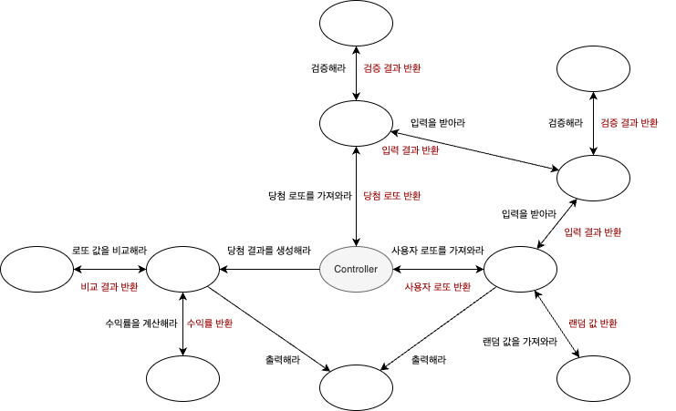

## 📝 나만의 로또 게임 

### - 목표 
=> 변화에 유동적으로 대응하기 쉽고 객체지향의 이점을 살릴 수 있는 로또 게임을 만든다. 
객체와 객체가 서로 협력하는, '살아있는' 시스템을 구성한다.

### - 그러기 위해서는 ...
- 재사용성이 높은 구조를 만든다.
- 역할, 책임, 협력을 중점적으로 설계한다.
- '클래스'보다는 '메세지'에 중점을 둔다.
- 객체는 자율성을 보장받아야 한다.
- 좋은 테스트가 작성되어야 한다. 
- 디자인 패턴 등의 원칙에 크게 의존하지 않는다.
---
### - 설계
#### 1차 단계 (메세지 다이어그램 구성)

