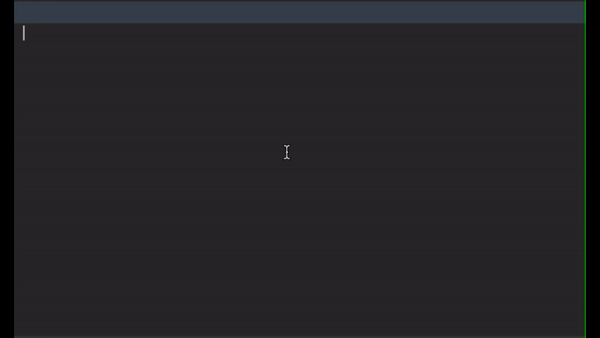

# 로또 게임



## 로또 게임이란.

- 로또 구입 금액을 입력하면 구입 금액에 해당하는 만큼 로또를 발행한다.
- 로또 1장의 가격은 1,000원이다.
- 당첨 번호와 보너스 번호를 입력받는다.
- 사용자가 구매한 로또 번호와 당첨 번호를 비교하여 당첨 내역 및 수익률을 출력하고 로또 게임은 종료된다.


# 프로그램 구성

## 메인 기능

- LottoMachin
	- 금액을 투입하면 금액에 맞는 로또를 반환해준다
- LottoWithBonus
	- 로또 번호와, 보너스 번호를 입력받는다.
- LottoJudge
	- 구매한 로또 목록과 LottoWithBonus 를 입력하면 로또 결과값을 알려준다.
- LottoReference
	- 로또 결과의 등수와 상금의 정보를 가지고 있다.
	- 로또 결과값을 입력하면, 등수 비교 결과 및 수익률을 알려준다.


# 로또 게임 기능 목록.

## Domain


### **LottoMachine**

- [x] 구입 금액은 1,000원 단위로 입력 받는다.
  - [x] 입력 금액이 1,000원으로 나누어 떨어지는 경우
    - [x] 로또 구입 금액 / 1000 한 개수만큼의 로또 값 출력
  - [x] 입력 금액이 1,000원으로 나누어 떨어지지 않는 경우  `IllegalArgumentException` 발생 후 메시지 출력
    - [x] "[ERROR] 입력한 금액이 1,000원으로 나누어 떨어지지 않습니다."

- [x] 중복되지 않는 숫자 6개  `pickUniqueNumbersInRange()` 사용
  - ex)`1,2,3,4,5,6`
  
- [x] buyLotteries
    ```java
    [8, 21, 23, 41, 42, 43] 
    [3, 5, 11, 16, 32, 38] 
    [7, 11, 16, 35, 36, 44] 
    ```


### **LottoJudge**

- [x] 사용자가 구매한 로또 번호와 당첨 번호를 비교하여 당첨 로또 결과값을 알려준다.
  - [x] 일치하는 번호를 카운트 한다.
  - [x] 5개 일치시 보너스 번호를 비교한다.

- [x] Lotto Reference에게 일치하는 번호를 넘겨 Lotto Result를 생성한다.
   - [x] Lotto Result는 Lotto Reference의 Enum 상수(등수)와, 횟수를 반환한다.


### **LottoReference**

- [x] 로또 당첨표
	- 당첨은 1등부터 5등까지 있다. 당첨 기준과 금액은 아래와 같다.
		- 1등: 6개 번호 일치 / 2,000,000,000원
		- 2등: 5개 번호 + 보너스 번호 일치 / 30,000,000원
		- 3등: 5개 번호 일치 / 1,500,000원
		- 4등: 4개 번호 일치 / 50,000원
		- 5등: 3개 번호 일치 / 5,000원

- [x] Lotto Judge 가 카운트한 값과 결과 당첨표를 비교한다.
  - [x] Enum 상수를 반환한다.

- [x] Lotto Result을 입력하면 수익율을 계산해 출력해준다.
  - [x] 총 당첨 금액을 구한다.
  - [x] 수익률을 계산한다.
    - [x] 수익률은 소수점 둘째 자리에서 반올림한다. (ex. 100.0%, 51.5%, 1,000,000.0%)
    


## VO (Value Object)


###  **Money**

- [x] 돈을 의미하는 객체
  - [x] 음수의 값이 입력되면  `IllegalArgumentException` 발생 후 메시지 출력
    - [x] "[ERROR] 숫자만 입력 가능합니다."


###  **Lotto**

- [x] 로또 발급 : 당첨 번호를 입력 받는다. 번호는 쉼표(,)를 기준으로 구분한다.
  - [x] 정상 값

    - [x] 로또 번호의 숫자 범위는 1~45까지이다.
    - [x] 1개의 로또를 발행할 때 중복되지 않는 6개의 숫자를 뽑는다.

    - [x] 로또는 오름차순, List<Integer>, ex) [3, 5, 11, 16, 32, 38] 

  - [x] 예외 처리  `IllegalArgumentException` 발생 후 메시지 출력

    - [x] "[ERROR] 로또 번호는 6자리 입니다."
    - [x] "[ERROR] 숫자만 입력 가능합니다."
    - [x] "[ERROR] 로또 번호의 범위는 1부터 45가지 입니다."
    - [x] "[ERROR] 로또 번호는 중복될수없습니다."


### LottoWithBonus

- [x] Lotto 값에 중복되면 안된다.
- [x] 하나의 값만 가진다.
- [x] 숫자 범위는 1~45까지이다.
- [x] 사용자가 잘못된 값을 입력할 경우 `IllegalArgumentException` 발생,
  - [x] "[ERROR] 보너스 번호의 범위는 1부터 45가지 입니다."
  - [x] "[ERROR] 보너스 번호는 로또 번호와 중복될수없습니다."


### BuyLottoList

- [x] LottoMachine을 통해 발급 받은 로또 리스트 (랜덤으로 발급된 값)


### LottoResult

- [x]  Enum 상수(등수)와, 횟수


## View


### InputHandler

- [x] inputMoney : "구입금액을 입력해 주세요."
  - [x] String to int, handling exception (숫자만 가능)
- [x] inputLottoNumber : "당첨 번호를 입력해 주세요."
  - [x] String to List<Integer>, handling exception (숫자만 가능)
- [x] inputBonusNumber : "보너스 번호를 입력해 주세요."
  - [x] String to Integer, handling exception (숫자만 가능)


### OutputHandler

- [x] printBuyLottoList : 구매한 로또 출력
- [x] LottoResult 값 출력
  - [x] winningStatistics : 당첨 통계

    ```
    당첨 통계
    ---
    3개 일치 (5,000원) - 1개
    4개 일치 (50,000원) - 0개
    5개 일치 (1,500,000원) - 0개
    5개 일치, 보너스 볼 일치 (30,000,000원) - 0개
    6개 일치 (2,000,000,000원) - 0개
    ```

  - [x] printYield : 수익률

  	```
  	총 수익률은 62.5%입니다.
  	```


## Controller


view 와 domain 을 연결시키는 부분입니다.

view 를 통해 사용자에게 입력 및 출력합니다. 입력 받은 값을 domain에게 전달해 값을 받습니다.

- [x] run()

	- view 와 domain 을 연결

- [x] inputMoney 

	- view 를 통해 사용자로부터 금액 입력
	- domain의 Money에게 금액 입력

- [x] inputLotto

	- view 를 통해 사용자로부터 로또번호 입력

	- domain의 Lotto에게 번호 입력

- [x] inputBonus

	- view 를 통해 사용자로부터 보너스 번호 입력
	- domain의 LottoWithBonus에게 금액 입력

- [x] outputResult
	- 당첨 통계와 수익률을 출력한다.


## 3주차 미션 학습한 내용


#### MVC 디자인 패턴 : Model, Controller, View
**Controller :** 뷰와 모델 사이에서 인터페이스의 역할을 한다. 컨트롤러는 데이터와 비즈니스 로직 사이의 인터페이스 역할을 한다.

**Model :** 프로그램의 데이터의 역할을 한다. 도메인 모델을 포함하기도 한다. Model 내부에 Controller, View와 관련된 코드가 있으면 안된다.

**View :** 사용자가 보는 화면을 만든다. 입, 출력 화면을 만든다. Model에만 의존한다.

사용자 인터페이스로부터 비즈니스 로직을 분리하면, 비즈니스 로직을 서로 영향 없이 쉽게 고칠 수 있는 코드가 된다.

디자인 패턴을 적용함으로써 코드도 읽기 수월해지고 유지보수가 쉬워지고, 재사용성이 증가한다.


#### 객체로 분리 및 단위 테스트

input과 output이 확실하게 정의되어 있고, 각각의 기능이 분리되어 단위 테스트가 쉽게 된다.


#### 테스트 코드를 작성하는 이유

테스트 코드를 작성하는 이유는, 내가 구현한 코드가 잘 작동하는지도 더블 체크 하는 기능을 한다. 테스트함으로써 논리적 실수를 쉽게 찾을 수 있게 된다.

주로 경곗값을 테스트한다. 예를 들어 1~10까지의 숫자 범위가 있는데, 3~6까지는 사용하면 안 된다고 가정했을 때, 2, 7 값과 3, 6 값을 넣어서 주로 테스트한다. 값의 경곗값에서 실수를 많이 하므로 주로 사용한다. 이처럼 테스트 코드를 작성하면 실수를 줄여 코드의 신뢰성을 줄 수 있게 된다.

즉, 테스트 코드를 작성함으로써 작성된 코드에 신뢰가 생기고, 기능 추가 및 유지보수에 가속도를 더해주게 된다.


#### Enum

1. 클래스를 상수처럼 사용 할 수 있다.
2. 서로 관련 있는 상수 값들을 모아 enum으로 구현하는 경우 유용하다.
3. 클래스와 같은 문법 체계를 따른다.
4. 상속을 지원하지 않는다.
5. 상태와 행위를 한곳에서 관리 가능하다.
6. 데이터의 그룹화

```java
public enum LottoReference {
    THREE(3, 5_000, ""),
    FOUR(4, 50_000, ""),
    FIVE(5, 1_500_000, ""),
    BONUS(5, 30_000_000, ", 보너스 볼 일치"),
    SIX(6, 2_000_000_000, ""),
    NOPE(0, 0, "");
    private final int prize;
    private final int correctCount;
    private final String message;

    LottoReference(int correctCount, int prize, String message) {
        this.prize = prize;
        this.correctCount = correctCount;
        this.message = message;
    }
  	
  	    public static LottoReference getLottoReference(int containsCount) {
        for (LottoReference lottoReference : LottoReference.values()) {
            if (lottoReference.getCorrectCount() == containsCount) {
                return lottoReference;
            }
        }
        return NOPE;
    }
}
```

위 코드는 로또 번호의 일치 개수와, 당첨금을 가지고 있는 하나의 클래스로 두 데이터의 연관성을 보여준다. 또한, 로또 번호의 일치 개수를 입력하면 일치하는 인스턴스를 반환하는 메소드를 통해 상태와 행위를 한곳에서 관리 가능하게 된다.
