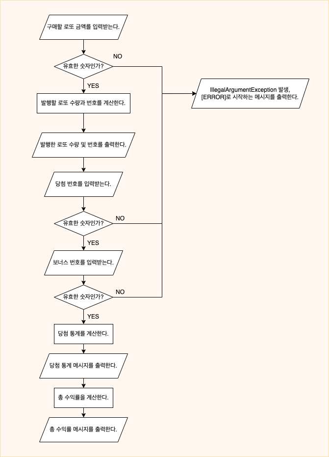

## 🗺 설계
* [x] 애플리케이션 흐름 구상하기

* [x] 애플리케이션을 실행하는 코어 객체 구현하기
* [ ] 의존성 주입 컨테이너 구현하기
* [x] 검증 클래스 의존성 분리하기
  * [x] 검증 클래스 리스트를 보관, 적절한 Validator를 찾아 실행하는 ValidatorHolder 클래스 구현하기
* [x] 변환 클래스 의존성 분리하기
  * [x] 변환 클래스 리스트를 보관, 적절한 Converter를 찾아 실행하는 ConverterHolder 클래스 구현하기

## 🐳 기능 구현

* [x] 구매할 로또 금액을 입력받는다.
  * [x] 유효한 숫자인가?
  * [x] 검증 실패시 IllegalArgumentException 발생, [Error]로 시작하는 메시지를 출력한다. 
* [x] 발행할 로또 수량과 번호를 계산한다.
  * [x] 발행할 로또 수량을 계산한다.
  * [x] 로또 수량만큼 로또를 생성한다.
* [x] 발행한 로또 수량 및 번호를 출력한다.
  * [x] 발행한 로또 수량을 출력한다.
  * [x] 발행한 로또 번호를 출력한다.
* [x] 당첨 번호를 입력받는다.
  * [x] 유효한 숫자인가?
  * [x] 검증 실패시 IllegalArgumentException 발생, [Error]로 시작하는 메시지를 출력한다.
* [x] 보너스 번호를 입력받는다.
  * [x] 유효한 숫자인가?
  * [x] 검증 실패시 IllegalArgumentException 발생, [Error]로 시작하는 메시지를 출력한다.
* [ ] 당첨 통계를 계산한다.
* [ ] 당첨 통계 메시지를 출력한다.
* [ ] 총 수익률을 계산한다.
* [ ] 총 수익률 메시지를 출력한다.

## 👀 구현 컨벤션
* 사용자의 입력 문제가 아닌 애플리케이션 내부 문제로 발생하는 예외는 IllegalStateException 을 발생하게 한다.
* IllegalStateException 이 발생했을 때는 '[Error] 예상치 못한 어플리케이션 문제가 발생했습니다.' 메시지를 출력하고 애플리케이션이 종료된다.