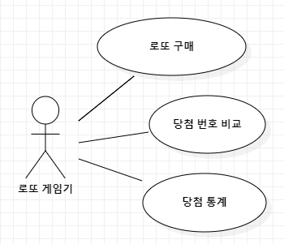
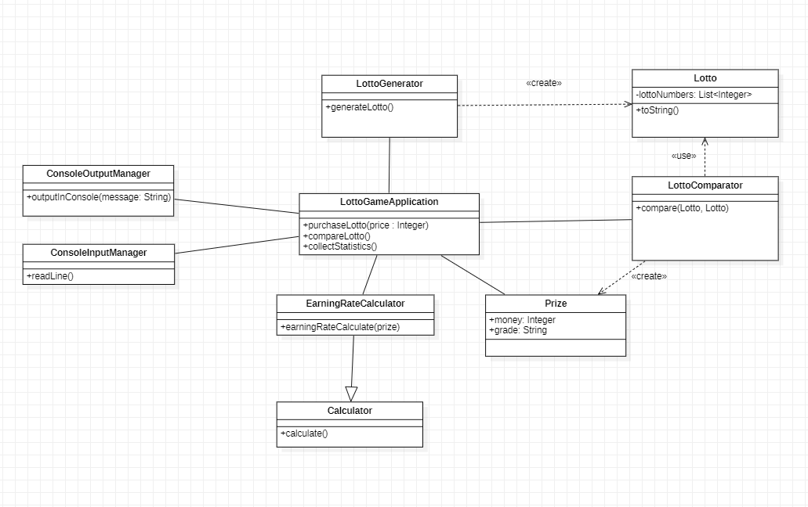
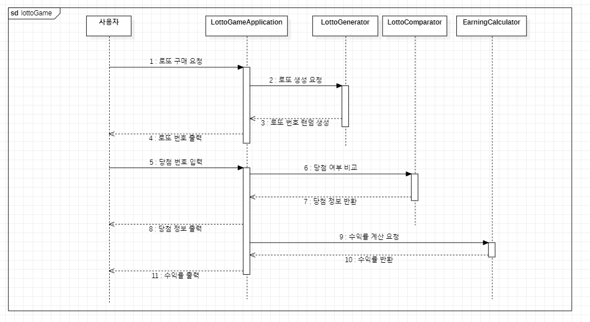

## 유스케이스 작성

사용자는 로또를 구매한다. 로또를 구매하기 위해 금액을 지불하고 금액에 맞는 만큼 로또를 구매할 수 있다. 모든 로또 번호는 자동으로 설정하여 구매한다.  구매가 끝나면 자신이 구매한 로또와 당첨 번호를 비교한다. 모든 로또와 비교하여 당첨 내역을 확인하고 자신의 수익률을 계산하여 통계를 낸다.

## 기능 요구 사항

1. 로또 번호의 숫자 범위는 1~45까지이다.
2. 1개의 로또를 발행할 때는 중복되지 않는 6개의 숫자를 뽑는다.
3. 당첨 번호는 중복되지 않는 숫자 6개와 보너스 번호 1개로 구성된다.
4. 당첨 번호 입력은 쉼표(,)를 기준으로 구분하며 보너스 번호는 당첨 번호 입력 후 입력 받는다.
5. 당첨은 1등부터 5등까지 존재하며 Enum클래스로 구현한다 당첨 목록은 다음과 같다.

    ```
    - 1등: 6개 번호 일치 / 2,000,000,000원
    - 2등: 5개 번호 + 보너스 번호 일치 / 30,000,000원
    - 3등: 5개 번호 일치 / 1,500,000원
    - 4등: 4개 번호 일치 / 50,000원
    - 5등: 3개 번호 일치 / 5,000원
    ```

6. 사용자가 로또 구입 금액을 입력하면 해당 금액에 맞는 로또를 발행한다.
7. 발행한 로또 번호는 오름차순으로 정렬하여 출력한다.
8. 구입 금액이 1,000원으로 나누어 떨어지지 않으면 예외 처리를 한다.
9. 사용자가 구매한 로또 번호와 당첨 번호를 비교하여 당첨 내역 및 수익률을 출력한다.
10. 잘못된 값을 입력할 시 IllegalArgumentException을 발생시키고 [ERROR]로 시작하는 에러 메시지를 출력 후 종료한다.

## 유스케이스 다이어그램



## 클래스 다이어그램



## 시퀀스 다이어그램



## 기능 구현 리스트

1. 로또 발행 기능 구현
    1. 중복되지 않은 숫자 6개로 구성되도록, 오름차순으로 정렬하여 저장
2. 당첨 번호와 비교하여 등수와 당첨금을 전달하는 기능 구현
    1. 등수와 당첨금은 요구사항에 제시된 대로 Enum으로 구현
3. 구매 금액과 당첨 금액을 이용하여 수익률을 계산하는 기능
    1. 소수점 둘째 자리 이하는 반올림