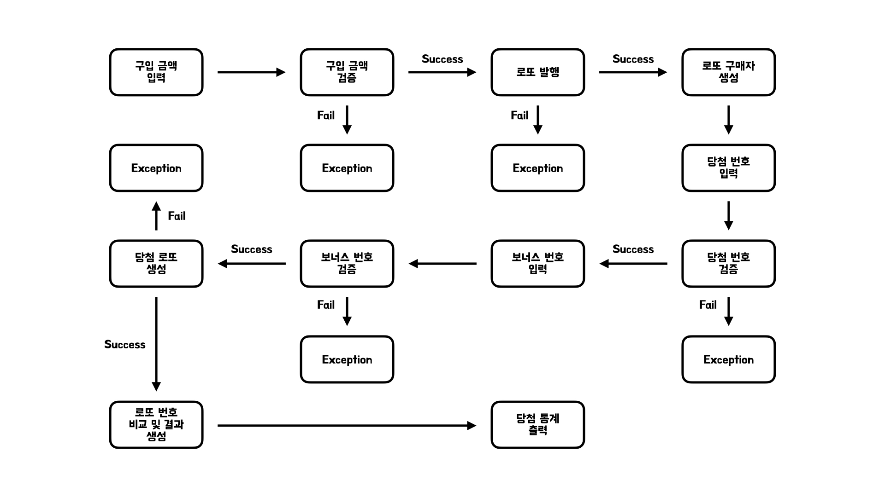

# 🎱 로또

## 📝 요구 사항 분석

### 규칙

- 로또 번호
    - 1~45 범위를 가진다.
    - 중복되지 않는 6개의 숫자를 가진다.
- 당첨 번호
    - 1~45 범위를 가진다.
    - 중복되지 않는 6개의 숫자를 가진다.
    - 6개와 중복되지 않는 보너스 번호가 존재한다.
- 당첨 기준
    - 1등 : 6개 번호가 일치하면 2,000,000,000원 상금
    - 2등 : 5개 번호 + 보너스 번호가 일치하면 30,000,000원 상금
    - 3등 : 5개 번호가 일치하면 1,500,000원 상금
    - 4등 : 4개 번호가 일치하면 50,000원 상금
    - 5등 : 3개 번호가 일치하면 5,000원 상금
    - 보너스 번호는 2등과 3등에만 영향을 준다.
- 로또 구입
    - 로또 1장의 가격을 1,000원이다.
    - 금액에 해당하는 만큼 로또를 구매한다.

### 입력

- 1,000원으로 나누어 떨어지는 로또 구입 금액을 입력받는다.
    - 나누어떨어지지 않는 경우 에러 메시지를 출력하고 예외 처리한다.
- 쉼표로 구분된 당첨 번호를 입력받는다.
    - 6개의 구분된 입력이 아닌 경우 예외 처리한다.
    - 구분된 값이 숫자가 아닌 경우 예외 처리한다.
    - 각각의 값이 범위의 값이 아닌 경우 예외 처리한다.
    - 중복된 숫자를 가지는 경우 예외 처리한다.
- 보너스 번호를 입력받는다.
    - 숫자가 아닌 경우 예외 처리한다.
    - 범위의 값이 아닌 경우 예외 처리한다.
    - 당첨 번호와 중복된 값을 가지는 경우 예외 처리한다.

### 출력

- 금액에 알맞게 발행한 로또 수량 및 각 로또의 번호를 출력한다.
    - 로또 번호는 오름차순으로 정렬되어 있다.
- 당첨 번호와 비교하여 당첨 내역을 출력한다.
    - 낮은 금액부터 오름차순으로 정렬되어 있다.
- 당첨 금액을 통해 수익률을 출력한다.
    - 수익률은 소수점 둘째 자리에서 반올림한다.
- 예외 상황 시 에러 문구를 출력한다.
    - 에러 문구는 [ERROR]로 시작한다.

## 🌊 실행 흐름

## ⚙️ 기능 구현

### 입력 기능을 구현한다. ▶️️ InputService

- [x] 구매 금액을 입력한다.
- [x] 당첨 번호를 입력한다.
- [x] 보너스 번호를 입력한다.

### 출력 기능을 구현한다. ▶️ OutputService

- [x] 발행 로또 정보를 출력한다.
- [x] 당첨 내역을 출력한다.
- [x] 수익률을 출력한다.
- [x] 에러 메시지를 출력한다.

### 변환 기능을 구현한다. ▶️ Converter

- [x] 문자열에서 숫자로 변환한다. ▶️ NumericConverter
    - [x] 숫자로 변환할 수 없다면 예외를 발생시킨다.
- [x] 문자열에서 숫자 리스트로 변환한다. ▶️ MultipleNumericConverter
    - [x] 숫자 리스트로 변환할 수 없다면 예외를 발생시킨다.

### 로또 로직을 구현한다. ▶️ Lotto

- [x] 로또를 생성한다.
    - [x] 숫자가 정해진 개수가 아니면 예외를 발생시킨다.
    - [x] 각 값이 정해진 범위에 속하지 않으면 예외를 발생시킨다.
    - [x] 중복된 숫자를 가지면 예외를 발생시킨다.
- [x] 숫자가 로또에 포함되어 있는지 확인한다.

### 당첨 로또를 구현한다. ▶️ WinningLotto

- [x] 당첨 로또를 생성한다.
    - [x] 보너스 번호가 정해진 범위에 속하지 않으면 예외를 발생시킨다.
    - [x] 보너스 번호가 당첨 번호와 중복된 숫자면 예외를 발생시킨다.
- [x] 로또를 비교하여 로또 등수를 반환한다.

### 로또 등수를 구현한다. ▶️ Rank

- [x] 개수에 따른 로또 등수를 생성한다.

### 당첨 내역을 구현한다. ▶️ Result

- [x] 수익률을 계산한다.

### 로또 구매자를 구현한다. ▶️ Consumer

- [x] 당첨 내역을 확인한다.

### 로또 애플리케이션을 구현한다. ▶️ LottoApplication

- [x] 로또를 진행한다.

## 🔎 체크리스트

- [x] [ERROR]로 시작하는 예외 메시지를 출력하는가
    - [x] 숫자가 아닌 문자열 구입 금액을 입력하면 예외가 발생하는가
    - [x] `1,000`원 단위로 나누어떨어지지 않는 구입 금액을 입력하면 예외가 발생하는가
    - [x] 음수면 예외가 발생하는가
    - [x] 쉼표로 구분된 당첨 번호가 `6`개 아니면 예외가 발생하는가
    - [x] 구분된 입력이 숫자가 아닌 문자열이면 예외가 발생하는가
    - [x] 구분된 입력이 정해진 범위`(1~45)`를 벗어나면 예외가 발생하는가
    - [x] 구분된 입력이 중복된 숫자를 가지면 예외가 발생하는가
    - [x] 보너스 번호가 숫자가 아닌 문자열이면 예외가 발생하는가
    - [x] 보너스 번호가 정해진 범위`(1~45)`를 벗어나면 예외가 발생하는가
    - [x] 보너스 번호가 당첨 번호와 중복된 숫자면 예외가 발생하는가
- [x] 알맞은 결과를 출력하는가
    - [x] 구입 금액 입력 시 입력 메시지를 출력하는가
    - [x] 구매한 로또 개수와 번호를 출력하는가
    - [x] 당첨 번호 입력 시 입력 메시지를 출력하는가
    - [x] 보너스 번호 입력 시 입력 메시지를 출력하는가
    - [x] 로또 결과를 알맞게 출력하는가
- [x] 테스트가 정상적으로 실행되는가
    - [x] 모든 테스트가 정상적으로 실행되는가
    - [x] `./gradlew clean test` 명령이 정상적으로 실행되는가
- [x] 요구사항을 만족하는가
    - [x] `java version`이 `11`인지 확인했는가
    - [x] `indent depth`를 `3`이 넘지 않도록 구현했는가
    - [x] 3항 연산자를 사용하지 않았는가
    - [x] 함수의 길이가 `15`라인을 넘지 않도록 구현했는가
    - [x] `else` 예약어를 사용하지 않았는가
    - [x] `Java Enum`을 적용했는가
    - [x] 도메인 로직 단위 테스트를 구현했는가
    - [x] `Randoms.pickUniqueNumbersInRange()`를 활용했는가
    - [x] `Console.readLine()`을 활용했는가
    - [x] `Lotto`에 매개변수가 없는 생성자를 추가하지 않았는가
    - [x] `numbers`의 접근 제어자를 `private`에서 변경하지 않았는가
    - [x] `Lotto`에 필드를 추가하지 않았는가