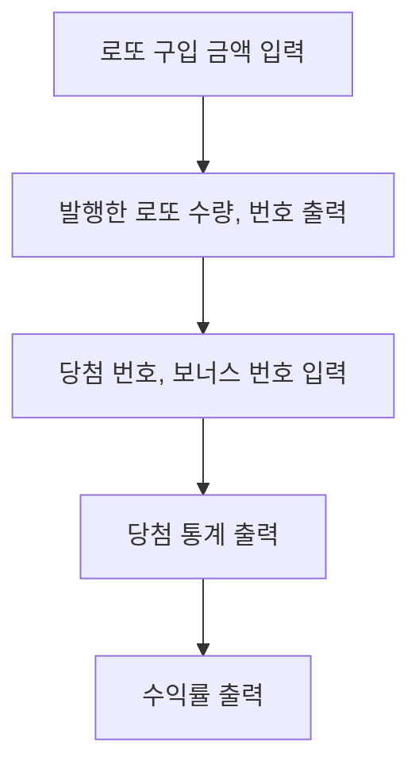

## 게임 플로우차트

## 기능 목록

#### 1. 로또 구입 금액 입력 `LottoStore`

- [x] 로또 구입 금액 입력 받기 (1장의 가격은 1,000원) `구입금액을 입력해 주세요.`
- [x] 다듬기: 공백 제거
- [x] 예외: 숫자가 아닌 경우
- [x] 예외: `int` 범위를 초과한 경우
- [x] 예외: 1,000원으로 나누어 떨어지지 않는 경우

#### 2. 발행한 로또 수량, 번호 출력

- [x] 발행한 로또 개수 구하기 `8개를 구매했습니다.` `LottoStore`
- [x] 1개의 로또를 발행할 때 1~45 중 중복되지 않는 6개의 숫자를 뽑는다. `PlayerNumber`
- [x] 로또 번호는 오름차순으로 정렬한다.
- [x] 로또 번호를 출력한다.

#### 3. 당첨 번호, 보너스 번호 입력

- [x] 당첨 번호를 입력 받는다.
- [x] 번호는 쉼표(,)를 기준으로 구분한다.
- [x] 예외: 쉼표로 구분한 개수가 6개가 아닌 경우 
- [x] 다듬기: 공백 제거
- [x] 예외: 숫자 이외의 값이 입력된 경우
- [x] 예외: 1~45 사이의 숫자가 아닌 값이 입력된 경우

- [x] 보너스 번호를 입력 받는다.
- [x] 예외: 숫자 이외의 값이 입력된 경우
- [x] 예외: 1~45 사이의 숫자가 아닌 값이 입력된 경우
- [x] 예외: 당첨 번호와 중복되는 값이 입력된 경우

#### 4. 당첨 통계 출력

- [x] 당첨 내역을 구한다.
- [x] 당첨 내역을 출력한다.

#### 5. 수익률 출력

- [ ] 수익률은 소수점 둘째 자리에서 반올림 
- [ ] 셋째 자리마다 쉼표를 찍는다.
- [ ] 결과를 출력한다. `총 수익률은 62.5%입니다.`