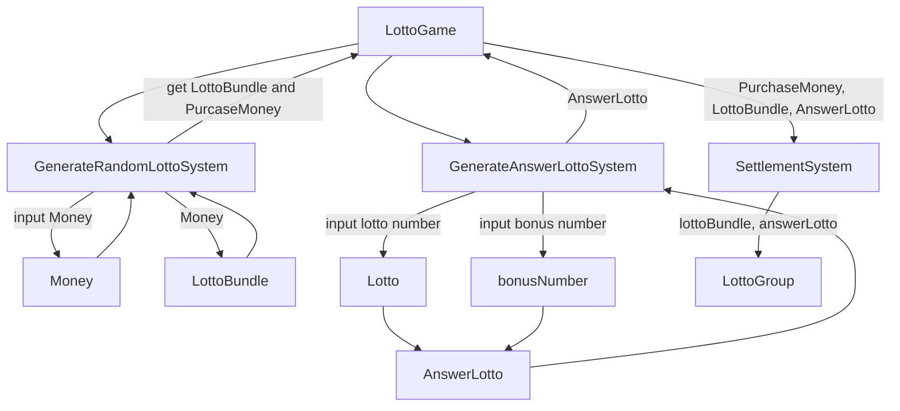

### 시작전 개인적인 제한사항

1. 요구사항 꼼꼼하게 읽기
2. 1번 요구사항 준수하기
3. 2번 요구사항 준수하기

## 게임 요구사항 분석

- 로또 번호는 1~45자리의 숫자로 이루어짐
- 총 6자리로 구성되며 각 자리는 중복이 없음
- 당첨로또는 중복되지 않는 숫자 6개와 보너스 번호 1개를 가집니다.
- 무작위 로또는 중복되지 않는 숫자 6개를 가집니다.
- 사용자는 금액을 입력할 수 있으며 입력 한 금액을 바탕으로 무작위 로또를 만들어 낼 수 있습니다.
- 당첨로또와 무작위 로또를 비교하여 당첨 결과를 확인합니다.
- 1등은 6개번호
- 2등은 5개번호와 보너스 번호 일치
- 3등은 5개번호 일치
- 4등은 4개번호
- 5등은 3개번호
- 등수없음은 2개이하의 번호가 일치하면 받을 수 있습니다.
- 금액별 수익률을 정산할 수 있습니다.

## 게임 진행 흐름



### 용어 정리

| 용어   |                                                        설명 |      
|:-----|----------------------------------------------------------:|
| 랜덤로또 |                                     랜덤하게 생성되는 6자리 로또 입니다. | 
| 당첨로또 |                               사용자가의 입력을 통해서 만들어지는 로또 입니다. | 
| 로또번호 |                                    랜덤,당첨 로또를 구성하는 번호 입니다. | 
| 보너스번호 |  보너스 번호는 로또 번호와 동일한 기능을 하며 당첨 로또 중에서 6자리를 제외한 나머지 번호 입니다. |
| 로또묶음 |               랜덤 로또 하나 이상을 모아 높은 집합이며 만들어진 순서대로 가지고 있습니다. |

## 도메인 요구사항

- 로또번호
    - [x] 로또 번호는 1~45까지의 숫자로 이루어져있다.
- 로또
    - 당첨 로또
        - [x] 당첨 로또는 생성자를 통해서 6자리 로또 번호를 입력 받습니다.
        - [x] 보너스 번호는 기존의 번호와 중복될 수 없습니다.
    - 랜덤 로또
        - [x] 로또 번호와 보너스 번호를 가집니다. (보너스 번호는 로또 번호와 동일한 객체입니다.)
    - 공통 사항
        - [x] 로또 번호는 6자리를 입력 받습니다.
        - [x] 각 자리 숫자는 오름차순으로 정렬되어야 합니다.
        - [x] 로또 번호는 중복 될 수 없습니다.
- 로또 묶음
    - [x] 로또 묶음은 생성자를 통해서 항목이 6개인 정수 리스트를 입력받습니다.
    - [x] 로또 묶음의 모든 로또를 출력할 수 있습니다.
    -
- 정산
    - [x] 로또 묶음과 당첨 로또를 입력받습니다.
    - [x] 해당 번호를 서로 비교하며 결과를 반환합니다.
- 등수
    - [x] 당첨자 별 등수를 표시할 수 있습니다.
    - [x] 비교점수를 통해서 등수를 반환합니다.
- 비교점수
    - [x] 비어있는 점수를 만들어 낼 수 있습니다.
    - [x] 일반점수와 보너스 점수가 같으면 같은 스코어로 취급합니다.
    - [x] 보너스 점수를 추가할 수 있습니다.
    - [x] 일반 점수를 추가할 수 있습니다.
    - [x] 현재 자신이 가지고 있는 점수에 맞는 등수를 반환합니다.
- 로또 비교
    - [x] 두개의 로또를 비교해서 스코어를 반환합니다.
    - [x] 보너스 번호가 일치하면 스코어의 1점을 추가합니다.

- 돈
    - [X] 돈은 문자열을 통해서 만들어집니다.
    - [X] 돈은 0보다 큰 자연수로 이루어진 문자열만 입력이 가능하며 1000으로 나누어 떨여질 수 있습니다.
    - [X] 수익률을 계산할 수 있어야 합니다.
        - 예를 들어 현재 들고 있는 금액이 8000원일 경우 입력된 금액이 5000원이면 62.5%의 수익률이 발생합니다.
- 로또 게임
    - 랜덤 로또 생성 시스템
        - [x] 랜덤 생성 시스템은 구매한 로또 갯수를 출력합니다.
        - [x] 랜덤 생성 시스템은 랜덤으로 생성된 로또를 출력합니다.
    - 정답 로또 생성 시스템
        - [x] 정답 로또 생성 시스템은 로또 번호와 보너스 번호를 입력 받습니다.
    - 정산 시스템
        - [x] 정산 시스템은 로또 묶음과 정답로또를 비교하여 결과를 반환합니다.

## 리팩토링 계획서

- 하나의 객체는 한 가지 책임을 가지도록 함
- 뷰 역할을 하는 객체이외에는 getter를 가지지 않도록 함

## 의문점

### CompareLotto class

```java
public class CompareLotto {

    public static Score compare(AnswerLotto answerLotto, Lotto randomLotto) {

        var lotto = answerLotto.getLotto();

        var score = compare(lotto, randomLotto);

        var bonusNumber = answerLotto.getBonusNumber();

        if (randomLotto.hasLottoNumber(bonusNumber.number())) {
            score = score.plusBonus();
        }
        return score;
    }

    private static Score compare(Lotto answerLotto, Lotto randomLotto) {
        var score = Score.generateEmptyScore();

        var count = answerLotto.compareCount(randomLotto);

        for (int i = 0; i < count; i++) {
            score = score.plusNormal();
        }
        return score;
    }
}
```

> 현재 로또A와 로또B를 비교하는 클래스가 존재한다.
> 비교하는 클래스의 존재로 각 로또는 getter를 가져야만 비교가 가능해졌는데 그냥 로또를 바로 비교해서 해당 스코어를
> 넘겨 줘도 무방하다고 생각된다.