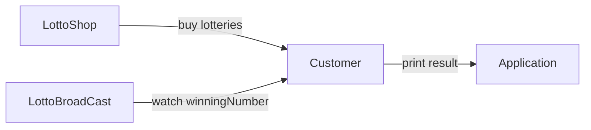
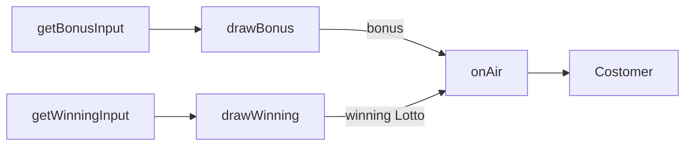
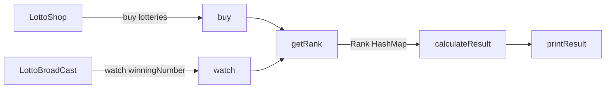

# Application 구조

# Util

## InputUtility

사용자의 입력을 처리하는 클래스

- **기능목록**
    - [ ]  사용자 입력을 받은 후 validation test 진행
    - [ ]  입력받은 추첨번호에 대해서 parsing 하는 함수

## ValidationUtility

사용자 입력과 관련된 유효성 검증 테스트를 진행하는 유틸리티 클래스

### validationTest

입력타입에 따라서 각기 다른 validationTest를 진행한다.

| 입력타입 | 상세 |
| --- | --- |
| LOTTO | 추첨번호를 입력받을시에 시행하는 validation test |
| BONUS | 보너스 추첨번호를 입력받을 경우 시행하는 validation test |
| AMOUNT | 사용자가 로또를 구매하는 경우 금액의 입력에 대해서 시행하는 validation test |
---
- ***`LOTTO`* validation test -** `isValidLotto`

    | 검증분류 | 상세 |
    | --- | --- |
    | isValidLottoInput | ,와 숫자 이외의 다른 문자가 들어 있는지 검사한다. |
    | isOutOfIndex | 숫자가 6개만 있는지 검사한다. |
    | isValidLottoRangeALL | 모든 숫자가 1-45 사이의 자연수인지 검사한다. |
    | isDistinct | 중복된 숫자가 없는지 검사한다.  |
- ***`BONUS`* validation test -** *`isValidBonus`*

    | 검증분류 | 상세 |
    | --- | --- |
    | isDigits | 숫자로 이루어져 있는지 검사한다.  |
    | isValidLottoRange | 보너스가 1-45 사이의 자연수인지 검사한다.  |
    | isDistinct | 로또와 보너스가 중복되는지 검사한다.  |
- ***`AMOUNT`* validation test -** *`isValidAmount`*

    | 검증분류 | 상세 |
    | --- | --- |
    | isDigits | 숫자로 이루어져 있는지 검사한다. |
    | isValidAmountRange | 입력된 금액이 양수인지 검사한다. |
    | isMultipleOfThousand | 입려된 금액이 1000의 배수인지 검사한다. |

## Type

validation test 진행시 사용되는 입력 타입를 정의한 enum class

| 입력타입 | value |
| --- | --- |
| LOTTO | 1 |
| BONUS | 2 |
| AMOUNT | 3 |

# Controller

## LottoShop

사용자에게 금액을 입력받아서 Lotto List를 생성하는 클래스

- **기능목록**
    - [ ]  랜덤 숫자 생성하기
    - [ ]  Lotto 객체 create

## LottoBroadcast

추첨번호를 뽑는 클래스

- **기능목록**
    - [ ]  로또 번호 추첨
        - [ ]  사용자 입력받기
    - [ ]  보너스 번호 추첨
        - [ ]  사용자 입력받기
        - [ ]  로또와 보너스 중복검사

## Customer

생성된 로또에 대한 정보를 저장하고 추첨번호와 비교하여 결과를 출력하는 클래스

- **기능목록**
    - [ ]  로또 순위 산정
    - [ ]  로또 순위 출력
    - [ ]  수익률계산

# Model

## Lotto

1-45까지의 번호 6개를 가지고 있는 클래스

## Rank

로또의 등수에 관한 정보들을 저장한  enum class

|  | same | prize |
| --- | --- | --- |
| OTHER | 0~2개 일치 | 0원 |
| FIFTH | 3개 일치 | 5,000원 |
| FOURTH | 4개 일치 | 50,000원 |
| THIRD | 5개 일치, 보너스 불일치 | 1,500,000원 |
| SECOND | 5개 일치, 보너스 일치 | 30,000,000원 |
| FIRST | 6개 일치 | 2,000,000,000원 |
