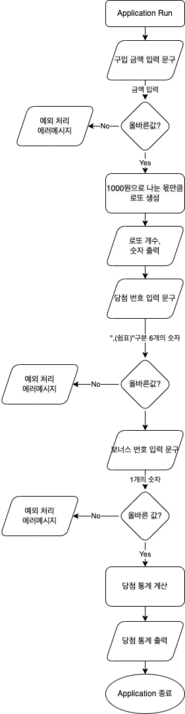

# 로또

## 기능 구현 목록

- [ ] 금액을 입력한다.
- [ ] 범위 1~45 사이의 랜덤한 숫자 6자리로 구성된 로또(Lotto)를 생성한다.
  - [ ] (입력한 금액) / 1000원 개 만큼 생성한다.
  - [ ] 중복되지 않는 숫자를 생성한다.
- [ ] 구매한 로또 개수를 출력한다.
- [ ] 구매한 로또들의 번호를 출력한다.
- [ ] 지난 주 당첨 로또를 입력한다.
  - [ ] 당첨 로또를 생성한다.
- [ ] 당첨 통계를 출력한다.
  - [ ] 당첨 금액(숫자 맞춘 개수) 별 당첨 로또 수를 계산한다.
- [ ] 총 수익률을 출력한다.
  - [ ] 총 수익률을 계산한다.

## flow



## input & output

```text
[출력] 구입금액을 입력해 주세요.
[입력] 8000

[출력] 8개를 구매했습니다.
[출력] [8, 21, 23, 41, 42, 43] 
[출력] [3, 5, 11, 16, 32, 38]
[출력] [7, 11, 16, 35, 36, 44] 
[출력] [1, 8, 11, 31, 41, 42]
[출력] [13, 14, 16, 38, 42, 45] 
[출력] [7, 11, 30, 40, 42, 43]
[출력] [2, 13, 22, 32, 38, 45]
[출력] [1, 3, 5, 14, 22, 45]

[출력] 당첨 번호를 입력해 주세요.
[입력] 1,2,3,4,5,6

[출력] 보너스 번호를 입력해 주세요.
[입력] 7

[출력] 당첨 통계
[출력] ---
[출력] 3개 일치 (5,000원) - 1개
[출력] 4개 일치 (50,000원) - 0개
[출력] 5개 일치 (1,500,000원) - 0개
[출력] 5개 일치, 보너스 볼 일치 (30,000,000원) - 0개
[출력] 6개 일치 (2,000,000,000원) - 0개
[출력] 총 수익률은 62.5%입니다.
```
