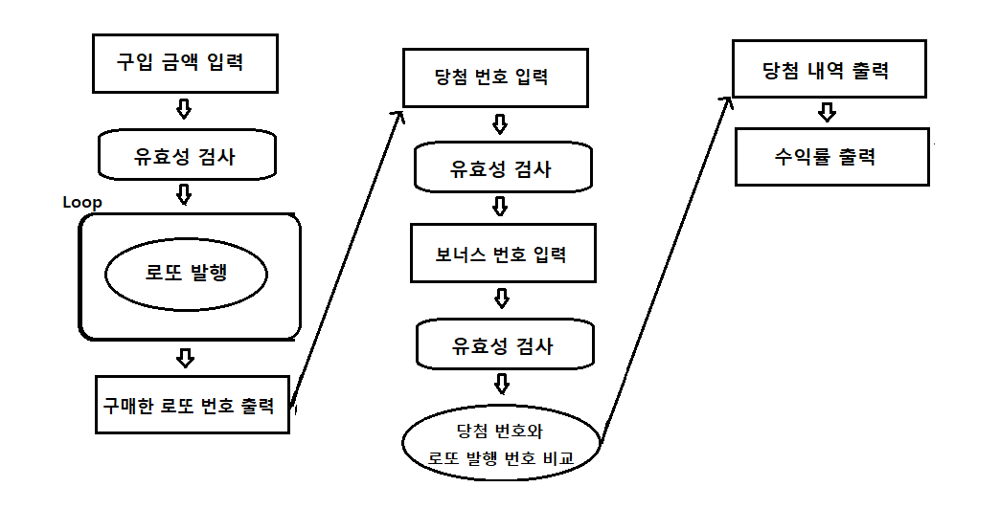

# 🚀 구현할 기능 목록

--- 

로또 발행
- 로또 번호 범위는 1 ~ 45까지이다.
- 중복되지 않는 6개의 숫자를 뽑는다.
- 구입 금액만큼 해당하는 로또 발행
- 로또 1장의 가격은 1000원

당첨 번호 발행
- 로또 번호 범위는 1 ~ 45까지이다.
- 중복되지 않는 숫자 6개와 보너스 번호 1개를 뽑는다.

당첨 번호와 로또 발행 번호 비교
- 6개 번호 일치 -> 1등(2,000,000,000)
- 5개 번호 + 보너스 번호 일치 -> 2등(30,000,000)
- 5개 번호 일치 -> 3등(1,500,000)
- 4개 번호 일치 -> 4등(50,000)
- 3개 번호 일치 -> 5등(5,000)

사용자가 잘못된 값 입력한 경우
- IllegalArgumentException 발생시키고
- 에러메시지 출력 후 종료

입력
- 로또 구입 금액 입력
  - 1000원 단위로 입력
  - 1000원으로 나누어 떨어지지 않는 경우 예외 처리
- 당첨 번호 입력
  - 쉼표를 기준으로 6개의 당첨 번호 입력
  - 1 ~ 45 범위 숫자가 아닐 시 예외 처리
- 보너스 번호 입력 
  - 1 ~ 45 범위 숫자가 아닐 시 예외 처리

출력
- 발행한 로또 수량 및 번호 출력
  - 로또 번호는 오름차순으로 출력
- 당첨 내역 출력
- 수익률 출력
  - 수익률은 소수점 둘째 자리에서 반올림한다.
  

---

## Flow 도식화

