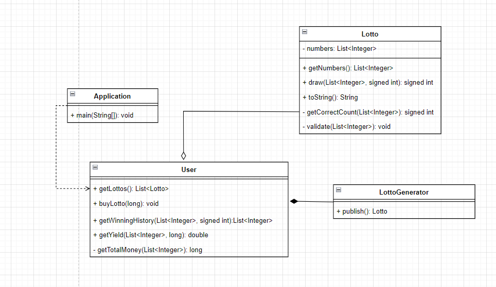
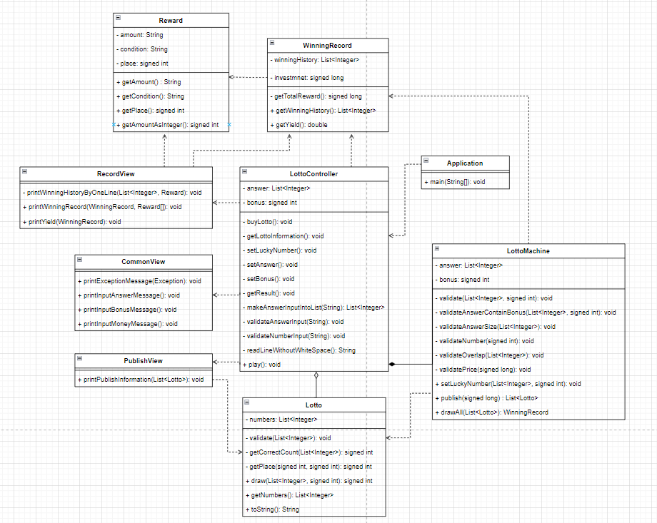

# 로또 미션 기능 리스트

## TOC

<!-- TOC -->

- [로또 미션 기능 리스트](#로또-미션-기능-리스트)
    - [TOC](#toc)
    - [1. 기능 요구 사항 💻](#1-기능-요구-사항-💻)
    - [2. 기능 리스트 만들기전 숙지 사항 💻](#2-기능-리스트-만들기전-숙지-사항-💻)
        - [설계전 숙지 사항](#설계전-숙지-사항)
        - [컨벤션 숙지사항](#컨벤션-숙지사항)
        - [테스트 숙지사항](#테스트-숙지사항)
        - [Lotto 클래스 관련 숙지사항](#lotto-클래스-관련-숙지사항)
    - [3. 첫 번째 구현 기능 리스트 💻](#3-첫-번째-구현-기능-리스트-💻)
        - [첫 번째 구현 클래스 다이어그램](#첫-번째-구현-클래스-다이어그램)
    - [4. 두 번째 구현 기능 리스트 💻](#4-두-번째-구현-기능-리스트-💻-(MVC를-적용))
        - [주의 사항](#주의-사항)
        - [기능 리스트](#기능-리스트)
        - [두 번째 구현 클래스 다이어그램](#두-번째-구현-클래스-다이어그램)

<!-- TOC -->

## 1. 기능 요구 사항 💻

```
- 로또 번호의 숫자 범위는 1~45까지이다.
- 1개의 로또를 발행할 때 중복되지 않는 6개의 숫자를 뽑는다.
- 당첨 번호 추첨 시 중복되지 않는 숫자 6개와 보너스 번호 1개를 뽑는다.
- 당첨은 1등부터 5등까지 있다. 당첨 기준과 금액은 아래와 같다.
    - 1등: 6개 번호 일치 / 2,000,000,000원
    - 2등: 5개 번호 + 보너스 번호 일치 / 30,000,000원
    - 3등: 5개 번호 일치 / 1,500,000원
    - 4등: 4개 번호 일치 / 50,000원
    - 5등: 3개 번호 일치 / 5,000원
```

- 로또 구입 금액을 입력하면 구입 금액에 해당하는 만큼 로또를 발행해야 한다.
- 로또 1장의 가격은 1,000원이다.
- 당첨 번호와 보너스 번호를 입력받는다.
- 사용자가 구매한 로또 번호와 당첨 번호를 비교하여 당첨 내역 및 수익률을 출력하고 로또 게임을 종료한다.
- 사용자가 잘못된 값을 입력할 경우 IllegalArgumentException를 발생시키고, "[ERROR]"로 시작하는 에러 메시지를 출력 후 종료한다.

## 2. 기능 리스트 만들기전 숙지 사항 💻

### 설계전 숙지 사항

- 제이슨은 요구 사항에서 기능(메서드)을 추출하고, 어떻게 묶을지(클래스) 고민했다.
- 시작전 스켈레톤을 구축하고, 개발 중 메서드가 길어지면 리팩토링을 고려한다.
- 함수(또는 메서드)의 길이가 15라인을 넘어가지 않도록 구현한다. (함수(또는 메서드)가 한 가지 일만 잘 하도록 구현한다.)
- 함수(또는 메서드)가 한 가지 일만 하도록 최대한 작게 만들어라.

### 컨벤션 숙지사항

- enum을 적용해야한다.
- else 예약어, switch/case를 쓰지 않는다.
- 3항 연산자를 쓰지 않는다.
- indent(인덴트, 들여쓰기) depth를 3이 넘지 않도록 구현한다. 2까지만 허용한다.
- 변수 이름에 자료형은 사용하지 않는다
- 값을 하드 코딩하지 않는다

### 테스트 숙지사항

- 도메인 로직에 단위 테스트를 구현해야 한다. 단, UI(System.out, System.in, Scanner) 로직은 제외한다.
- 처음부터 큰 단위의 테스트를 만들지 않는다
    - ex) 사용자의 숫자가 컴퓨터의 숫자와 1개는 일치하고, 위치가 다르면 1볼을 출력한다.
- 핵심 로직을 구현하는 코드와 UI를 담당하는 로직을 분리해 구현한다.
- 함수가 한 가지 기능을 하는지 확인하는 기준을 세운다. (메서드 15라인)

### Lotto 클래스 관련 숙지사항

- 제공된 Lotto 클래스를 활용해 구현해야 한다.
- Lotto에 매개 변수가 없는 생성자를 추가할 수 없다.
- numbers의 접근 제어자인 private을 변경할 수 없다.
- Lotto에 필드(인스턴스 변수)를 추가할 수 없다.
- Lotto의 패키지 변경은 가능하다.

## 3. 첫 번째 구현 기능 리스트 💻

- [ ✔ ] 로또를 발행해야 한다. `LottoGenerator#publish`
- [ ✔ ] 로또를 추첨한다. `Lotto#draw`
- [ ✔ ] 로또가 유효한지 검사한다. `Lotto#validate`
- [ ✔ ] 로또 구입 금액을 입력하면 구입 금액에 해당하는 만큼 로또를 구매한다. `User#buyLotto`
- [ ✔ ] 사용자가 구매한 로또 번호와 당첨 번호를 비교하여 당첨 내역을 출력한다. `User#getWinningHistory`
- [ ✔ ] 사용자가 구매한 로또 번호와 당첨 번호를 비교하여 수익률을 출력한다. `User#getYield`

### 첫 번째 구현 클래스 다이어그램

<p align="center">
  
</p>

## 4. 두 번째 구현 기능 리스트 💻 (MVC를 적용)

### 주의 사항

아래 규칙을 만족시키면서, MVC로 재구현한다.

```
1. Model은 Controller와 View에 의존하지 않아야 한다.
2. View는 Model에만 의존해야 하고, Controller에는 의존하면 안된다.
3. View가 Model로부터 데이터를 받을 때는,  사용자마다 다르게 보여주어야 하는 데이터에 대해서만 받아야 한다.
4. Controller는 Model과 View에 의존해도 된다.
5. View가 Model로부터 데이터를 받을 때 , 반드시 Controller에서 받아야 한다.
```

### 기능 리스트

#### Model

- Reward 모델
    - [ ✔ ] 문자열로 가지고 있는 보상 데이터를 숫자로 반환한다. `Reward#getAmountAsInteger`

- Lotto 모델
    - [ ✔ ] 몇등짜리 로또인지 추첨한다. `Lotto#draw`
    - [ ✔ ] 로또 번호 리스트의 문자열을 반환한다. `Lotto#toString`
    - [ ✔ ] 유효한 로또인지 검사한다. `Lotto#validate`

- LottoMachine 모델
    - [ ✔ ] 금액에 맞게 로또를 발행한다. `LottoMachine#publish`
    - [ ✔ ] 입력된 모든 로또를 추첨하고 로또의 기록을 반환한다. `LottoMachine#drawAll`
    - [ ✔ ] 당첨 번호와 보너스번호를 저장한다. `LottoMachine#setLuckyNumber`
    - [ ✔ ] 당첨 번호와 보너스번호, 입력된 돈을 유효성검사한다. `LottoMachine#validate`

- WinningRecord 모델
    - [ ✔ ] 당첨 기록을 반환한다. `WinningRecord#getWinningHistory`
    - [ ✔ ] 수익률을 반환한다. `WinningRecord#getYield`

#### View

- CommonView
    - [ ✔ ] 예외 상황 시 에러 문구를 출력해야 한다. `Commontview#printExceptionMessage`
    - [ ✔ ] 당첨 번호 입력 문구를 출력한다. `CommonView#printInputAnswerMessage`
    - [ ✔ ] 보너스 번호 입력 문구를 출력한다. `CommonView#printInputBonusMessage`
    - [ ✔ ] 구입금액 입력 문구를 출력한다. `CommonView#printInputMoneyMessage`

- PublishView
    - [ ✔ ] 발행한 로또 수량 및 번호를 출력한다. `PublishView#printPublishInformation`

- RecordView
    - [ ✔ ] 당첨 내역을 출력한다. `RecordView#printWinningRecord`
    - [ ✔ ] 수익률은 소수점 둘째 자리에서 반올림해서 출력한다. `RecordView#printYeild`

#### Controller

- [ ✔ ] 로또 애플리케이션을 시작한다. `LottoController#play`
- [ ✔ ] 로또를 구매하도록 중개한다. `LottoController#buyLotto`
- [ ✔ ] 구매한 로또를 출력하도록 중개한다. `LottoController#getLottoInformation`
- [ ✔ ] 보너스 번호를 입력하도록 중개한다. `LottoController#setBonus`
- [ ✔ ] 당첨 번호를 입력하도록 중개한다. `LottoController#setAnswer`
- [ ✔ ] 결과를 출력하도록 중개한다. `LottoController#getResult`
- [ ✔ ] 입력값을 유효성검사한다. `LottoController#validateInput`

### 두 번째 구현 클래스 다이어그램

<p align="center">
  
</p>