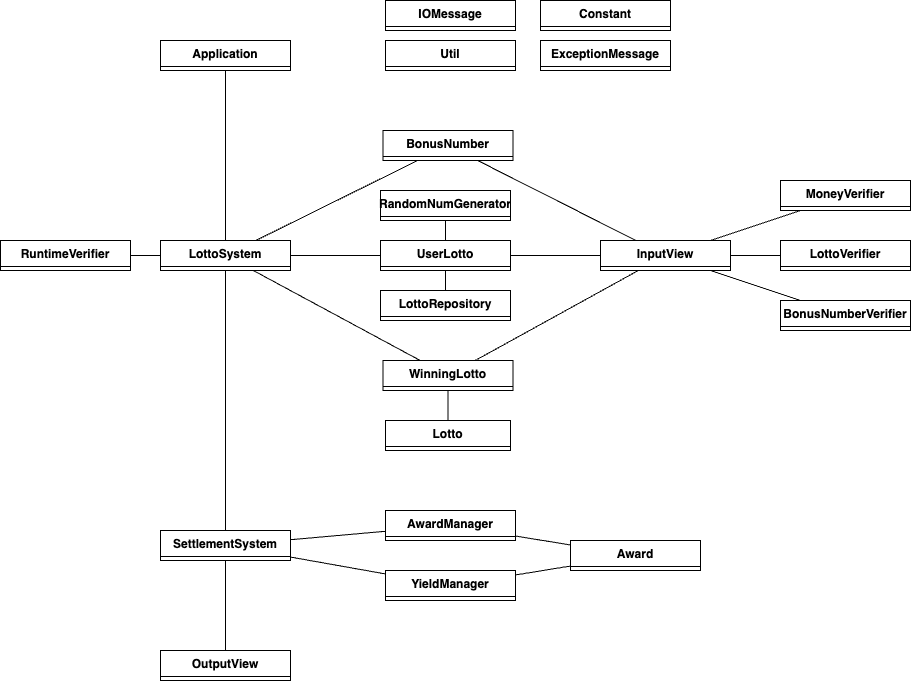

## 📝 나만의 로또 게임 

### - 목표 
=> 변화에 유동적으로 대응하기 쉽고 객체지향의 이점을 살릴 수 있는 로또 게임을 만든다. 
중앙처리식 시스템보다는 객체와 객체가 서로 협력하는, '살아있는' 시스템을 구성한다.

### - 그러기 위해서는 ...
- 재사용성이 높은 구조를 만든다.
- 역할, 책임, 협력을 중점적으로 설계한다.
- '클래스'보다는 '메세지'에 중점을 둔다.
- 객체는 자율성을 보장받아야 한다.
- 좋은 테스트가 작성되어야 한다. 
- 디자인 패턴 등의 원칙에 크게 의존하지 않는다.
---
### - 설계
#### 1차 단계 (메세지 다이어그램 구성)

#### 기능 명세

- 입력
> [기능] 로또 구입 금액을 입력받는 기능  
> [기능] 당첨 번호를 입력받는 기능  
> [기능] 보너스 번호를 입력받는 기능  
>
> 
- 출력
> [기능] 당첨 통계를 출력하는 기능  
> [기능] 수익률을 출력하는 기능  
> [기능] 로또 정보를 출력하는 기능  
> [기능] 몇 개의 로또를 구매했는지 출력하는 기능  
>
> 
- 로직
> [기능] 사용자 로또를 관리하는 기능  
> - 돈을 입력받는 기능  
> - 랜덤 값으로 로또 객체를 만드는 기능  
> - 돈에 맞는 적절한 개수의 로또를 생성하는 기능  
> - 로또 개수를 반환하는 기능  
> - N번째 로또 객체를 가져오는 기능  
> - 모든 로또 정보를 출력하는 기능  
>
> 
> [기능] 보너스 번호를 관리하는 기능  
> - 보너스 번호를 입력받는 기능  
> - 보너스 객체를 반환하는 기능  
> 
> 
> [기능] 당첨 로또를 관리하는 기능  
> - 당첨 로또를 입력받는 기능  
> - 당첨 로또를 통해 다른 로또를 채점하는 기능(=같은 원소가 몇개인지 반환)  
> 
> 
> [기능] 로또끼리 비교해, 같은 원소 개수를 반환하는 기능  
> [기능] 로또 정보를 출력하는 기능  
> [기능] 로또가 해당 숫자를 포함하는지 알려주는 기능  
> 
>
> [기능] 당첨 결과를 생성하는 기능  
> - 당첨 로또와 사용자 로또를 비교하는 기능  
> - 당첨 결과를 만드는 기능  
> - 수익률을 계산하는 기능  
>
>
> [기능] 랜덤한 값을 생성하는 기능  
> - 랜덤한 여러 개의 고유한 값을 리스트로 생성하는 기능  
>
> [기능] 상금을 반환하는 기능  
> 
> 
> [기능] 사용자 로또와 당첨 로또를 비교하는 기능  
> - 당첨 로또와 사용자 로또를 비교하는 기능  
> - 사용자 로또 개수를 반환하는 기능  
> - 당첨 로또 개수를 반환하는 기능  
> 
>
> [기능] 수익률을 소수점 둘째 자리에서 반올림하는 기능  
> [기능] 수익률을 컴마가 있는 적당한 형태로 가공하는 기능  
>
> [기능] 검증 기능 (아래의 모든 예외를 검증한다)  
> 
>
- 예외
> [예외] 로또 구입 금액이 숫자가 아닌 경우  
> [예외] 로또 구입 금액이 자료형의 범위를 벗어나는 경우  
> [예외] 로또 구입 금액이 1000원으로 나누어 떨어지지 않는 경우  
> [예외] 로또 구입 금액이 음수인 경우   
> 
> [예외] 당첨 번호가 6개가 아닌 경우  
> [예외] 당첨 번호 각각이 숫자가 아닌 경우  
> [예외] 당첨 번호 중 자료형의 범위를 벗어나는 경우가 있는 경우  
> [예외] 당첨 번호 각각이 1부터 45까지의 수가 아닌 경우  
> [예외] 당첨 번호가 중복되는 경우   
> 
> [예외] 보너스 번호가 숫자가 아닌 경우  
> [예외] 보너스 번호가 자료형의 범위를 벗어나는 경우  
> [예외] 보너스 번호가 1부터 45까지의 수가 아닌 경우  
> [예외] 보너스 번호가 당첨 번호에 포함되는 경우  

---
### - 최종 클래스 다이어그램

