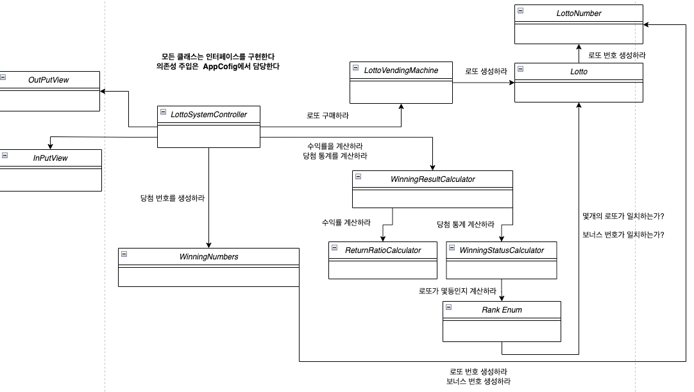

## 목차

- 클래스 다이어그램
- 기능목록
- 요구사항 재구성
- 놓치기 쉬운 요구사항 채크리스트
- TODO LIST

## 클래스 다이어그램



## 기능 목록

---

[  ] 로또를 구매할 총 금액을 입력받는 기능

- [  ] 1000원 이상의 자연수가 아닌 문자열은 입력받을 수 없다
- [  ] 1000원으로 나누어 떨어져야 한다. 나머지는 허용하지 않는다

[  ] 구매한 로또를 생성하는 기능

- [  ]  로또는 6개의 수로 이루어져있다
- [  ]  1~45 사이의 수 이어야 한다
- [  ] 서로 다른 수 이어야 한다
- [  ] 로또의 생성 수는 (구매할 총 금액/1000) 이다

[  ]  구매한 로또 목록을 출력하는 기능

- [  ] 각 로또의 번호는 오름차순으로 정렬되어 있다
- [  ] 로또 목록 출력전 안내문을 출력해야 한다

[  ] 당첨 번호를 입력받는 기능

- [  ] 각 숫자는 , 를 구분자로 사용한다
- [  ] 입력은 1~45사이의 서로 다른 6개의 수로 이루어진 문자열이다 ex) “1,2,3,4,5,6”
- [  ] 보너스 번호를 입력받는다
- [  ] 1~45사이의 수 1개로 이루어진 문자열이다
- [  ] *당첨 번호와 중복되면 안된다

[  ] 구매한 로또 목록과 당첨 번호를 비교하는 기능

[  ] 수익률을 계산하는 기능

- [  ] 소수점 둘째자리에서 반올림 한다

[  ] 당첨 통계를 출력하는 기능

- [  ] 당첨금이 작은 것부터 출력해야 한다

[  ] 수익률을 출력하는 기능

- [  ] 수익율은 소수점 둘째 자리에서 반올림 한다

[  ] 기타 기능

- [  ] 제시된 예외 외에도 양식에 맞춰 처리되어야 한다

## 요구사항 재구성

---

**개요)**

이 프로그램은 사용자가 구매한 로또들의 총 당첨금을 계산하여, **당첨 통계 및 구매 소모 비용 대비 수익률**을 알려준다

로또를 구매하면 1~45사이의 서로 다른 수로 이루어진 6개의 번호를 자동으로 생성한다

로또는 장당 1000원이며 사용자는 낸 금액에 해당하는 수량을 구매할 수 있다

프로그램은 입력한 당첨 번호와 보너스 번호를 사용자가 구매한 로또들과 대조해 총 당첨금액을 계산한다

이후, 당첨 통계와 수익률을 화면에 출력하고 프로그램을 종료한다

**예시)**

1. 로또를 구매할 총 금액을 입력
2. 1~45사이의 서로 다른 수로 이루어진 6개의 번호를 자동으로 생성
3. 안내문과 생성한 번호 출력
4. 1~45사이의 서로 다른 수로 이루어진 당첨 번호 6개 입력
5. 보너스 번호 입력
6. 당첨 통계 출력
7. 수익률 출력
8. 종료

```java
구입금액을 입력해 주세요.
        8000

        8개를 구매했습니다.
        [8,21,23,41,42,43]
        [3,5,11,16,32,38]
        [7,11,16,35,36,44]
        [1,8,11,31,41,42]
        [13,14,16,38,42,45]
        [7,11,30,40,42,43]
        [2,13,22,32,38,45]
        [1,3,5,14,22,45]

        당첨 번호를 입력해 주세요.
        1,2,3,4,5,6

        보너스 번호를 입력해 주세요.
        7

        당첨 통계
        ---
        3개 일치(5,000원)-1개
        4개 일치(50,000원)-0개
        5개 일치(1,500,000원)-0개
        5개 일치,보너스 볼 일치(30,000,000원)-0개
        6개 일치(2,000,000,000원)-0개
        총 수익률은62.5%입니다.
```
