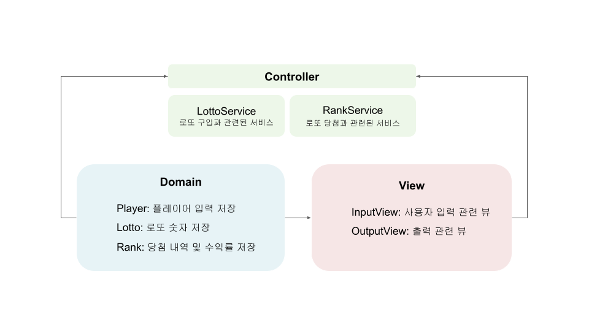

# 기능 목록

---

# Controller

### LottoService

- 플레이어 구입 금액 설정
- 구입 금액 만큼의 로또 번호 설정

### RankingService

- 플레이어의 당첨 번호 설정
- 플레이어의 보너스 번호 설정
- 로또 당첨 내역 설정
- 수익률 설정

# View

### 입력

- 로또 구입 금액을 입력 받는다.
- 당첨 번호를 입력받는다.
- 보너스 번호를 입력받는다.

### 출력

- 발행한 로또 수량 및 번호를 출력한다.
- 당첨 내역을 출력한다.
- 수익률을 출력한다. (소수점 둘째 자리에서 반올림)

# Domain

### Player
- 로또 구입 금액 저장
- 로또 구입 횟수 저장 
- 구입한 로또 목록 저장
- 사용자 당첨 번호 저장
- 사용자 보너스 번호 저장
- 로또 구입횟수 구하기 

### Lotto
- 로또 목록 생성 (🤔 Player? Lotto?)

### Rank
- 당첨 내역 저장
- 로또 번호에 당첨 번호가 있는지 확인합니다. 
- 당첨된 등수의 횟수를 설정합니다. 
- 당첨 내역을 문자열로 변환합니다. (🤔 여기? 아니면 InputUtil..?)

- 수익률 저장
- 수익률 계산하기

# Utils

### InputUtils

사용자 입력이 유효한지 테스트 합니다.

- 로또 구입 금액 입력 시 
   - 1000원 단위로 나누어 떨어지지 않는 경우
- 당첨 번호 입력 시
  - 당첨 번호 개수가 6개 미만/초과하여 입력한 경우
  - 당첨 번호를 쉼표(,)로 구분하지 않은 경우

- 보너스 번호 입력 시
    - 당첨 번호를 2개 이상 입력한 경우

- 정수 이외의 문자를 입력받는 경우
- 1~45 사이의 수가 아닌 경우
- 아무것도 입력하지 않은 경우

- 리스트를 문자열로 변환 
- 문자열을 정수로 변환 
- 문자열을 쉼표 단위로 나누어 정수 리스트로 변환 

### RandomUtils

- 당첨 번호 및 보너스 번호의 중복성 체크
- 1~45까지 6개의 랜덤 숫자 생성