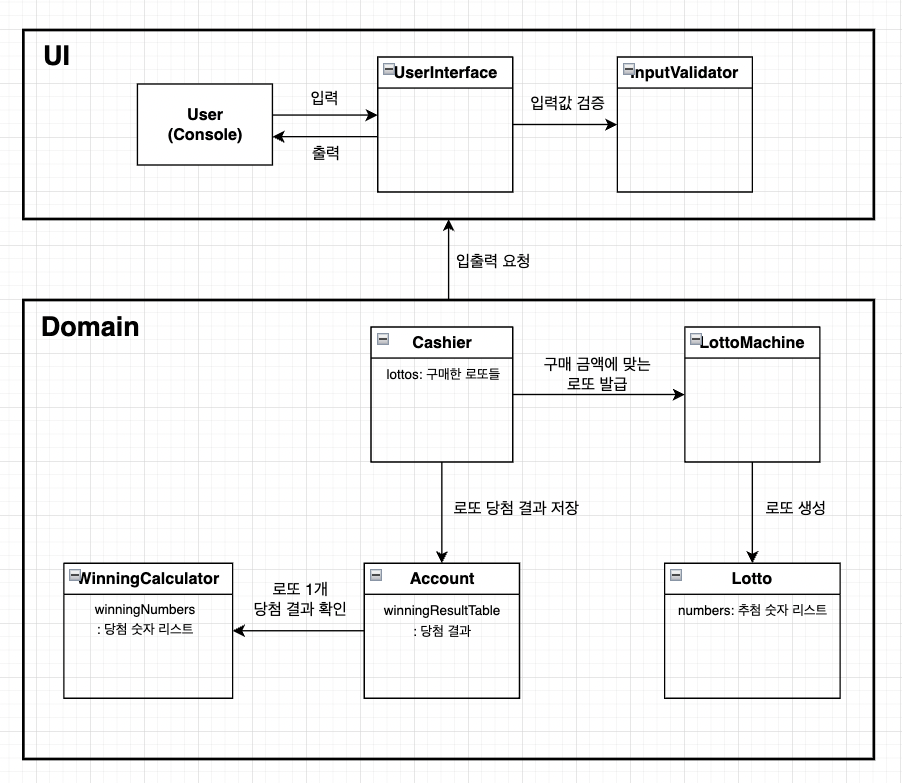

# 프로그램 설명
>- 사용자가 원하는 금액만큼의 로또를 발급하고, 당첨 결과 및 수익률을 출력한다.
>- 일반적인 로또 당첨 방식과는 다르게, 사용자가 당첨 및 보너스 숫자를 직접 입력한다.
>- 자세한 기능에 대한 설명은, 루트 디렉토리의 `README.md` 파일을 참고한다.
---
# 도메인 모델링

>- UserInterface : 사용자 입출력
>- InputValidator : 입력값 예외 처리
>- Cashier : 로또 발급과 당첨금 계산을 요청
>- LottoMachine : 로또를 발급
>- Lotto : 로또 정보를 보관
>- Account : 총 로또 당첨 결과를 관리
>- WinningCalculator : 1개의 로또 당첨 결과를 계산
---

# 기능 구현 목록

## UI
### UserInterface
- [x] 구매 금액 입력
- [x] 구매 결과 출력
- [x] 당첨 번호 입력
- [x] 보너스 번호 입력
- [x] 당첨 통계 출력
  - [x] 당첨 결과 출력
  - [x] 수익률 출력

### InputValidator
- [x] (예외 처리) 입력 금액 : 0으로 시작하지 않는 4자리 이상 9자리 이하 숫자
- [x] (예외 처리) 당첨 번호 : 공백 없이 ","로 이어진 6개 숫자
- [x] (예외 처리) 보너스 번호
  - [x] 숫자 1개
  - [x] 9자리 이하의 숫자
---

## Domain
### Cashier
- [x] 구매 금액 만큼 로또 발행 요청
  - [x] 입력 금액 숫자로 변경
- [x] 당첨 결과 저장 요청
- [x] 당첨 결과 출력 요청

### LottoMachine 
- [x] 구매 금액에 맞는 로또 발행
    - [x] 구매 금액에 맞는 발행 개수 세기
    - [x] 로또 번호 발행
- [x] (예외 처리) 입력 금액
  - [x] 1000의 배수 여부

### Lotto
- [x] (예외 처리) 번호
  - [x] 중복 확인
  - [x] 로또 규칙 범위 안에 있는지 확인
  - [x] 개수 확인
- [x] 번호 반환

### Account
- [x] 당첨 결과 저장
- [x] 당첨 결과 반환
  - [x] 당첨 금액의 합 저장
  - [x] 수익률 계산
    - [x] 총 로또 개수 계산

### WinningCalculator
- [x] 당첨 번호 저장
  - [x] 당첨 번호 입력 문자열을 숫자 리스트로 변력
- [x] 보너스 번호 저장
- [x] 로또 1개의 당첨 여부 계산
    - [x] 당첨 번호와 비교
    - [x] 보너스 번호 포함 여부 확인
    - [x] 해당하는 결과 확인
- [x] (예외 처리) 당첨 번호
  - [x] 파싱을 위해 int 범위 바깥 수 예외 처리
  - [x] 번호 개수 확인
  - [x] 로또 규칙 범위 안에 있는지 확인
  - [x] 중복 확인
- [x] (예외 처리) 보너스 번호
  - [x] 파싱을 위해 int 범위 바깥 수 예외 처리
  - [x] 로또 규칙 범위 안에 있는지 확인
  - [x] 당첨 번호에 이미 포함되지 않았는지 확인
---

## Constant
### (enum) WinningResult : 당첨 관련 규칙 상수 집합
- [x] 구현하기

### LottoRule : 로또 발행 관련 규칙 상수 저장
- [x] 구현하기

### ErrorMessage : 에러 메시지 상수 저장
- [x] 구현하기
---

## test
- [x] UI 로직을 제외한 단위 테스트 작성 완료
  
>- Cashier의 메서드들은 모두 다른 클래스의 메서드를 호출하는 형식입니다.
>  - --> 다른 클래스의 단위 테스트로 Line coverage 100%를 만들었습니다.

---

# 프로그램 관련 특이사항
> ### 1,000원 이상 1,000,000,000원 미만의 구매 금액만 허용합니다.
>- 10억원 이상의 로또를 구매할 경우가 많지 않다고 판단했습니다.
>- (국내 로또 기준, 회차별 1인당 10만원의 구매한도 적용)
>
> ### 로또 규칙 변경에 유연성 확보
>- 규칙(번호 개수, 번호 범위, 당첨금 등) 변경 시, 도메인 로직 변경 없이 상수만 수정하면 됩니다.
>- (일부 정규식, 테스트 코드 수정 필요)