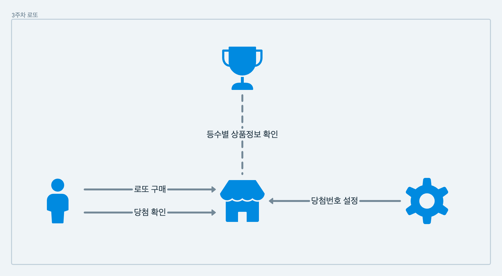

# 로또
## 구성 예시

 

## 기능 구현 목록
### 로또 용지 - Lotto
- [ ] 지정된 번호로 로또를 생성한다. - generateRandomNumbers
- [ ] 생성된 로또를 검증한다. - validate
  - 로또 번호의 숫자 범위는 1~45까지이다. - validateRange
  - 1개의 로또를 발행할 때 번호가 중복되면 안된다. - validateDuplicate
  - 총 6개의 숫자를 뽑는다. - validateSize
  - 잘못된 값이 들어온 경우 `IllegalArgumentException`를 발생시키고, "[ERROR]"로 시작하는 에러 메시지를 출력 후 종료한다. 
### 구매자 - Buyer
- [ ] 로또 구입 금액을 입력하면 구입 금액에 해당하는 만큼 로또를 발행해야 한다. - buyLotto
  - [ ] 로또 구입 금액을 입력 받는다. - inputSeedMoney
    - 로도 구입 금액을 검증한다. - validateSeedMoney
      - 구입 금액은 1,000원 단위로 입력 받으며 1,000원으로 나누어 떨어지지 않는 경우 예외 처리한다.
      - 사용자가 잘못된 값을 입력할 경우 `IllegalArgumentException`를 발생시키고, "[ERROR]"로 시작하는 에러 메시지를 출력 후 종료한다.
- [ ] 당첨 내역을 출력한다. - checkPrize
  - 당첨 통계 확인 ... - requestPrizeToStore
  - 당첨 내역 출력 - printPrize
- [ ] 수익률을 출력한다. - checkRate
  - 수익률 계산하기 = 최종수익 / 구매가격 - calcRate
  - 수익률은 소수점 둘째 자리에서 반올림한다. (ex. 100.0%, 51.5%, 1,000,000.0%) - roundRate
  - 수익률 출력하기.. format: 총 수익률은 n%입니다. - printRate
### 로또 가게 - Store
- [ ] 로또 구입 금액을 입력하면 구입 금액에 해당하는 만큼 로또를 발행해야 한다. - sellLotto
  - 로또 1장의 가격은 1,000원이다. - valid1000Unit
  - 구입 금액에 해당하는 만큼 로또를 발행한다. - issueLotto
  - 로또 번호는 오름차순으로 정렬하여 보여준다. - sortLotto
  - 발행한 로또 수량 및 번호를 출력한다. - printLottoInform
- [ ] 당첨 확인: 사용자가 구매한 로또 번호와 당첨 번호를 비교하여 당첨 내역을 반환 - checkPrize
### 상품 정보 - Prize
- [ ] 등수별 상품 정보를 담아둔다. 
  - 당첨은 1등부터 5등까지 있다. 당첨 기준과 금액은 아래와 같다.
      - 1등: 6개 번호 일치 / 2,000,000,000원
      - 2등: 5개 번호 + 보너스 번호 일치 / 30,000,000원
      - 3등: 5개 번호 일치 / 1,500,000원
      - 4등: 4개 번호 일치 / 50,000원
      - 5등: 3개 번호 일치 / 5,000원
### 관리자 - Admin
- [ ] 당첨 번호와 보너스 번호를 입력받는다. - inputGameNumbers
  - [ ] 당첨 번호를 입력받는다. - inputWinningNumbers
    - 번호는 쉼표(,)를 기준으로 구분한다. - splitSeparator
    - 당첨 번호 입력시 "당첨 번호를 입력해주세요." 메세지가 표시된다. - printInputWinningNumbers
  - [ ] 보너스 번호를 입력 받는다. - inputBonusNumber
      - 보너스 번호 입력시 "보너스 번호를 입력해주세요." 메세지가 표시된다. - printInputBonusNumber
  - [ ] 당첨 번호를 검증한다. - validateGameNumbers
    - 당첨 번호 추첨 시 중복되지 않는 숫자 6개와 - validateWinningNumbers
    - 중복되지 않는 보너스 번호 1개를 뽑는다. - validateBonusNumber

 

## 체크 사항
### 요구 사항
- [Java 코드 컨벤션](https://github.com/woowacourse/woowacourse-docs/tree/master/styleguide/java) 가이드를 준수하며 프로그래밍한다.
- 프로그래밍 요구 사항에서 달리 명시하지 않는 한 파일, 패키지 이름을 수정하거나 이동하지 않는다.
- indent(인덴트, 들여쓰기) depth를 3이 넘지 않도록 구현한다. 2까지만 허용한다.
    - 예를 들어 while문 안에 if문이 있으면 들여쓰기는 2이다.
- 3항 연산자를 쓰지 않는다.
- 함수(또는 메서드)가 한 가지 일만 하도록 최대한 작게 만들어라.
- 함수(또는 메서드)의 길이가 15라인을 넘어가지 않도록 구현한다.
    - 함수(또는 메서드)가 한 가지 일만 잘 하도록 구현한다.
- else 예약어를 쓰지 않는다.
    - 힌트: if 조건절에서 값을 return하는 방식으로 구현하면 else를 사용하지 않아도 된다.
    - else를 쓰지 말라고 하니 switch/case로 구현하는 경우가 있는데 switch/case도 허용하지 않는다.
- Java Enum을 적용한다.
- 도메인 로직에 단위 테스트를 구현해야 한다. 단, UI(System.out, System.in, Scanner) 로직은 제외한다.
    - 핵심 로직을 구현하는 코드와 UI를 담당하는 로직을 분리해 구현한다.
- [커밋 메시지 컨벤션](https://gist.github.com/stephenparish/9941e89d80e2bc58a153) 가이드를 참고해 커밋 메시지를 작성한다.
